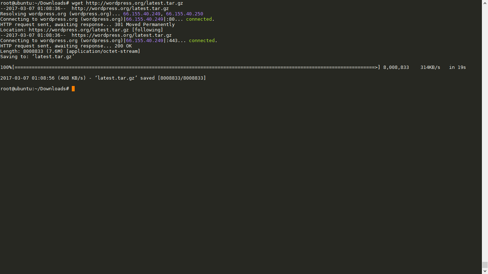
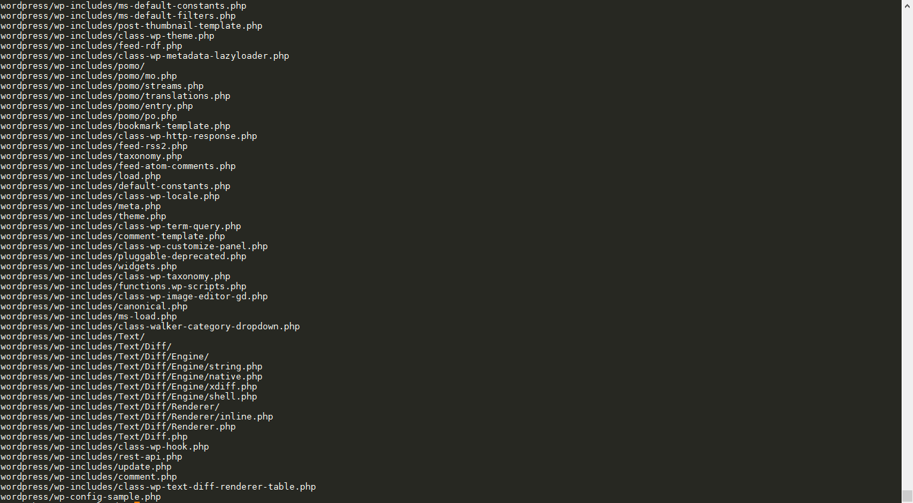
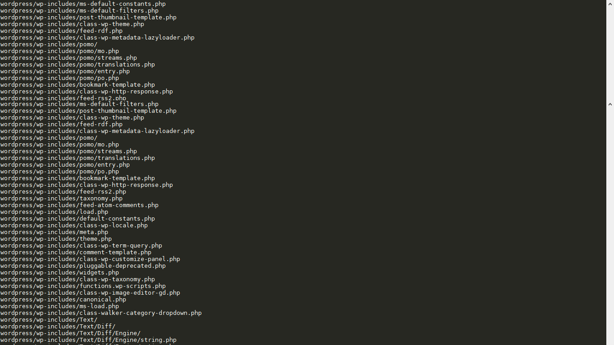
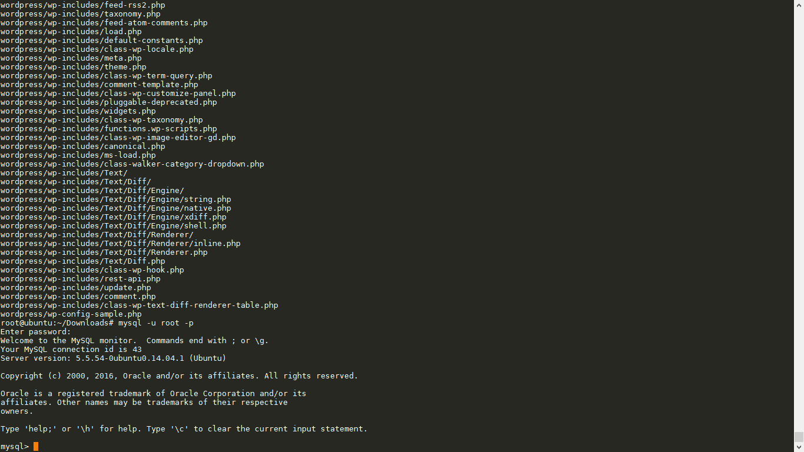
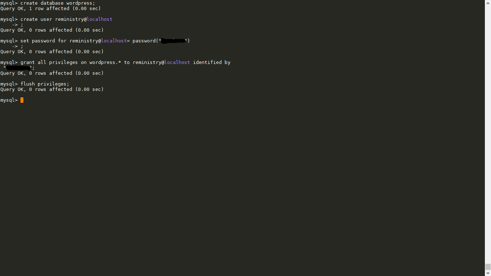
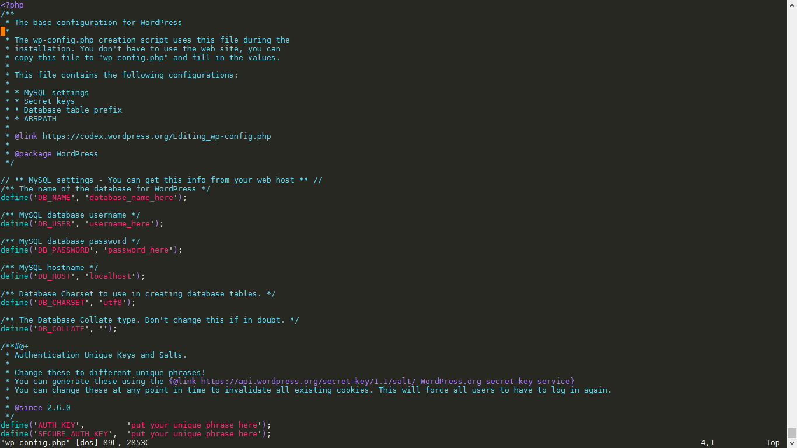
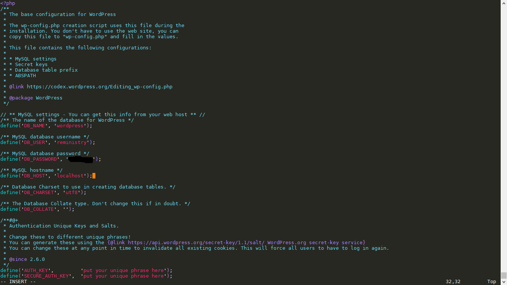
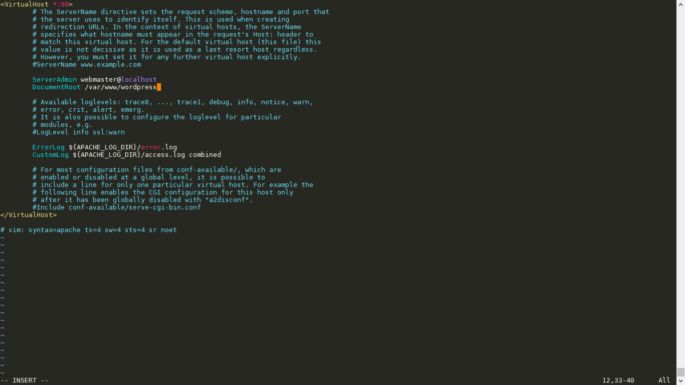
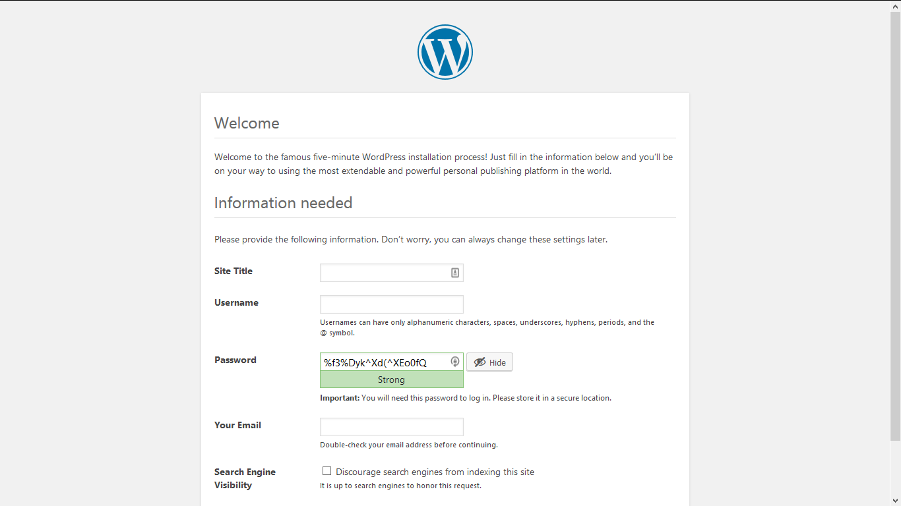

# Báo cáo: TÌm hiểu và cài đặt Wordpress trên Ubuntu Server

## 1. Các nội dung chính

- Khái niệm Wordpress.
- Cài đặt Wordpress.

## 2. Nội dung

### 2.1 Wordpress là gì?

- `Wordpress`:
	+ là một phần mềm nguồn mở (Open Source Software) được viết bằng ngôn ngữ lập trình website PHP (Hypertext Preprocessor) và sử dụng hệ quản trị cơ sở dữ liệu MySQL.
	+ là một mã nguồn mở bằng ngôn ngữ PHP để hỗ trợ tạo blog cá nhân, và nó được rất nhiều người sử dụng ủng hộ về tính dễ sử dụng, nhiều tính năng hữu ích. Qua thời gian, số lượng người sử dụng tăng lên, các cộng tác viên là những lập trình viên cũng tham gia đông đảo để phát triển mã nguồn WordPress có thêm những tính năng tuyệt vời.
	+ `WordPress` đã được xem như là một hệ quản trị nội dung (CMS – Content Management System) vượt trội để hỗ trợ người dùng tạo ra nhiều thể loại website khác nhau như blog, website tin tức/tạp chí, giới thiệu doanh nghiệp, bán hàng – thương mại điện tử, thậm chí với các loại website có độ phức tạp cao như đặt phòng khách sạn, thuê xe, đăng dự án bất động sản.

### 2.2 Vì sao `Wordpress` được nhiều người lựa chọn sử dụng?

- `Dễ sử dụng`
	+ `WordPress` được phát triển nhằm phục vụ đối tượng người dùng phổ thông, không có nhiều kiến thức về lập trình website nâng cao
- `Cộng đồng hỗ trợ đông đảo`
	+ `Wordpress` là một mã nguồn CMS mở phổ biến nhất thế giới, điều này cũng có nghĩa là bạn sẽ được cộng đồng người sử dụng WordPress hỗ trợ bạn các khó khăn gặp phải trong quá trình sử dụng.
- `Nhiều gói giao diện có sẵn`
	+ `Wordpress` có hệ thống Theme đồ sộ, nhiều theme chuyên nghiệp có khả năng SEO tốt.
	+ Giúp cho bạn dễ dàng chọn lựa, bố trí hình ảnh, màu sắc cho trang web của bạn một cách đẹp mắt ...  
- `Nhiều widget hỗ trợ`
	+ `Wordpress` có 23 Widget như:
		- Thống kê số truy nhập blog
		- Các bài mới nhất, Các bài viết nổi bật nhất
		- Các comment mới nhất
		- Liệt kê các chuyên mục
		- Liệt kê các Trang
		- Danh sách các liên kết
		- Liệt kê số bài viết trong từng tháng
- `Dễ phát triển`
	+ `Wordpress` cung cấp cho bạn rất nhiều hàm viết sẵn, cho phép bạn tùy ý phát triển website của mình một cách chuyên nghiệp
	+ `WordPress` là một mã nguồn mở nên bạn có thể dễ dàng hiểu được cách hoạt động của nó và phát triển thêm các tính năng

- `Hỗ trợ nhiều ngôn ngữ`
	+ Được phát triển bằng nhiều ngôn ngữ (hỗ trợ tiếng việt)

- `Tính tùy biến trang website cao`
	+ `Wordpress` cho phép bạn có thể điều chỉnh trang website theo ý muốn của bạn, không nhất thiết đó phải là một trang blog, mà nó còn có thể trở thành một trang web về bán hàng, một trang web đại diện cho công ty bằng việc kết hợp các theme được hỗ trợ cùng các widget có sẵn

## 3. Cách cài đặt `Wordpress` trên Ubuntu Server

### 3.1 Điều kiện tiên quyết để có thể cài đặt

Nếu bạn muốn cài đặt `Wordpress` lên trên thiết bị của bạn thì buộc chúng cần phải được cài đặt:
- `Apache`
- `PHP`
- `MySQL`

Sau đây sẽ là các bước để cài đặt `Wordpress` trên Ubuntu Server

- Bước 1: Cài đặt `Apache`
	`Apache` là một mã nguồn mở miễn phí được sử dụng hơn 50% trong tổng số các web server trên thế giới
	Để cài đặt apache, bạn hãy mở terminal và gõ câu lệnh:
		
    > `sudo apt-get update`

    > `sudo apt-get install apache2`
- Bước 2: Cài đặt `MySQL`
	`MySQL` là một hệ quản trị cơ sở dữ liệu mạnh mẽ được nhiều người sử dụng
	Để cài đặt mysql, bạn hãy mở terminal và gõ câu lệnh:
	> `sudo apt-get install mysql-server libapache2-mod-auth-mysql php5-mysql`

	Trong quá trình cài đặt MySQL, bạn sẽ nhận được yêu cầu thiết lập mật khẩu cho tài khoản `root`.  Mật khẩu này sẽ được sử dụng để bạn có thể quản lý và truy xuất các dữ liệu sau này.

- Bước 3: Cài đặt `PHP`
	PHP là một ngôn ngữ kịch bản mã nguồn mở được sử dụng rộng rãi để tạo lên những trang web động
	Để cài đặt php, bạn hãy mở terminal và gõ câu lệnh:
	> `sudo apt-get install php5 libapache2-mod-php5 php5-mcrypt`

### 3.2 Tiến hành cài đặt `Wordpress`

- Bước 1, để tiến hành cài đặt `Wordpress`, theo cá nhân mình, bạn nên tạo một thư mục chẳng hạn như `Downloads` để dễ dàng cho việc quản lý sau này. Để làm điều này, bạn hãy mở terminal lên và gõ câu lệnh:
	> `cd ~ && mkdir Downloads && cd Downloads`

- Bạn cần download mã nguồn mới nhất của `Wordpress` bằng câu lệnh:
	> `wget http://wordpress.org/latest.tar.gz`
	

- Với câu lệnh trên, bạn sẽ tải về một file nén tại thư mục `Downloads`. Bạn cần phải giải nén file này ra bằng việc sử dụng câu lệnh:
	> `cp latest.tar.gz /var/www/ && cd /var/www && tar -xvf latest.tar.gz`
	

- Bước 2, Tạo một database cho WordPress và User
	Để làm điều này, bạn hãy mở terminal và gõ câu lệnh:
	> `mysql -u root -p`
	

	Bạn hãy nhập mật khẩu ở phía trên, khi bạn cài đặt mysql để đăng nhập vào giao diện điều khiển.
	

	Đầu tiên, bạn hãy tạo một database có thể tên tùy ý. Ở đây, mình lấy tên là `wordpress`:
	> `mysql> create database wordpress;`
	
	> Query OK, 1 row affected (0.00 sec)
	
	Tiếp theo, bạn cần tạo một user cho phép quản lý database trên. Ở đây mình lấy tên user là `reministry`:
	> `mysql> create user reministry@localhost;`
	
	> Query OK, 0 rows affected (0.00 sec)

	Và, thiết lập password cho người dùng vừa rồi:
	> `mysql> set password for reministry@localhost= password('password');`
	
	> Query OK, 0 rows affected (0.00 sec)

	Cuối cùng là cấp quyền cho user vừa rồi
	> `mysql> grant all privileges on wordpress.* to reministry@localhost;`
	
	> Query OK, 0 rows affected (0.00 sec)
		
	> `mysql> flush privileges;`
	
	> Query OK, 0 rows affected (0.00 sec)
	
	

	> `mysql> exit`

- Bước 3: Cấu hình cài đặt cho `WordPress`

	Bước đầu tiên, bạn hãy tạo một file cấu hình cho wordpress bằng việc copy lại một file cấu hình mẫu sẵn có và sửa đổi nội dung của nó. Để làm điều này, bạn hãy mở terminal lên và gõ câu lệnh:
	> `cd wordpress`
	
	> `cp wp-config-sample.php wp-config.php && vi wp-config.php`

	Bạn sẽ nhìn thấy được nội dung như sau:
	

	Hãy chỉnh sửa lại các giá trị tại:
	- `database_name_here`
	- `username_here`
	- `password_here`
	
	sao cho phù hợp với những gì đã tạo và lưu file đó lại.
	

- Bước 4: Copy các file từ thư mục vừa giải nén sang `/var/www/`
	Để hoàn tất quá trình cài đặt, source code của wordpress cần phải được lưu lại /var/www/
	Đầu tiên, bạn cần chỉnh lại file cấu hình apache thay /var/www/html:
	> `vi /etc/apache2/sites-available/000-default.conf`
	
	
	
	>`service apache2 restart`

- Vậy là bạn đã cài đặt thành công WordPress trên hệ thống. Để truy cập và sử dụng WordPress, bạn hãy truy cập vào địa chỉ là địa chỉ ip của VM. Ví dụ: 192.168.9.129

