# 2. Tìm hiểu về tính năng Captive Portal trong pfSense

____

# Mục lục

- [2.1 Giới thiệu về Captive Portal](#about)
- [2.2 Tính năng, ứng dụng của Captive Portal](#useful)
- [2.3 Cách thực hiện cấu hình](#config)
- [2.4 Kiểm tra kết quả](#checking)
- [2.5 Cấu hình Captive Portal xác thực người dùng sử dụng Voucher](#voucher)
- [Các nội dung khác](#content-others)

____

# <a name="content">Nội dung</a>

- ### <a name="about">2.1 Giới thiệu về Captive Portal</a>

    - Trong pfSense có một tính khá là hữu ích đó là `Captive Portal`. Đây là một kỹ thuật buộc người dùng phải chứng thực qua 1 giao diện web trước khi kết nối vào internet. Kỹ thuât này thường áp dụng cho các điểm truy cập wifi, mạng có dây. Người dùng muốn truy cập vào, phải có một account chứng thực, ...

- ### <a name="useful">2.2 Tính năng, ứng dụng của Captive Portal</a>

    - Trong thực tế, `Captive Portal` được biết đến với cái tên đầy hoa mĩ `Wi-Fi Marketing` bởi vì nó được ứng dụng khá nhiều trong vai trò marketing. Ngày nay, `Wi-Fi Marketing` được cung cấp và sử dụng trong nhiều doanh nghiệp từ lớn tới nhỏ. `WiFi Marketing` là một trong những cách sáng tạo và hiệu quả nhất để quảng cáo thương hiệu. Bằng cách truyền đạt thông điệp hoặc nội dung trực tiếp tới khách hàng tiềm năng hoặc người dùng gần điểm phát.

    - Như đã được đề cập ở nội dung phần giới thiệu về `Captive Portal`. Qua việc tạo ra một vùng phủ sóng dựa trên công nghệ không dây WiFi cho phép bất cứ ai có thiết bị di động (laptop, điện thoại smartphone, máy tính bảng Tablet…) Được trang bị công nghệ WiFi để kết nối và truy cập các dịch vụ hoặc nội dung đã được được cung cấp sẵn.

    - Hệ thống trong giải pháp `WiFi Marketing` tạo điều kiện cho khách hàng truy cập miễn phí. Nhưng trước tiên họ phải điều hướng request tới nội dung của một trang website mà chúng ta đã chuẩn bị sẵn. Ở đây chúng ta sẽ có cơ hội hiển thị cho họ sản phẩm, dịch vụ của ta đã và đang cung cấp, khuyến mãi hoặc đơn giản là thông tin liên quan đến doanh nghiệp của mình.

    - Những lợi ích của giải pháp `Captive Portal` đem lại khi được ứng dụng vào thực tế:

        + Xây dựng thương hiệu:
            - Các tin tức, thông tin, hình ảnh về doanh nghiệp sẽ nằm dưới quyền kiểm soát của mình bằng việc tùy chỉnh trang website mà người buộc phải truy cập tới khi muốn sử dụng internet.

        + Tiếp cận quảng cáo của khách hàng:
            - Quảng cáo sẽ được tiếp cận tới người sử dụng khi họ truy cập và sử dụng Wi-Fi

        + Là giải pháp đa giải pháp:
            - Được thể hiện qua việc cung cấp website được hỗ trợ bởi nhiều thiết bị Table, Smartphone và Laptop, PC.

        + Giới hạn băng thông người sử dụng:
            - Để tránh các vấn đề có thể bị lạm dụng. Ta có thể kiểm soát lưu lượng sử dụng internet của người dùng. Nhờ vậy mà băng thông sẽ được chia sẻ một cách hợp lý tới người sử dụng.

        + Quản lý phiên hoạt động:
            - Thời gian kết nối của một người sử dụng có thể điều chỉnh bất cứ lúc nào. Có thể thiết lập thời gian sử dụng khác nhau cho mọi người. Ta luôn có sự lựa chọn để thay đổi các thiết lập.

        + Cổng thông tin điện tử:
            - Ta có thể lợi dụng website mà `Captive Portal` sử dụng để xác thực để tạo lên một trang tin tức nội bộ.

- ### <a name="config">2.3 Cách thực hiện cấu hình</a>

    - Đầu tiên, hãy cùng nhìn mô hình ta mà sẽ triển khai. Tuy nhiên vì việc cấu hình được thực hiện trên máy ảo. Không được hỗ trợ công nghệ Wi-Fi nên sẽ không thể áp dụng được với các thiết bị di động không dây.

        > 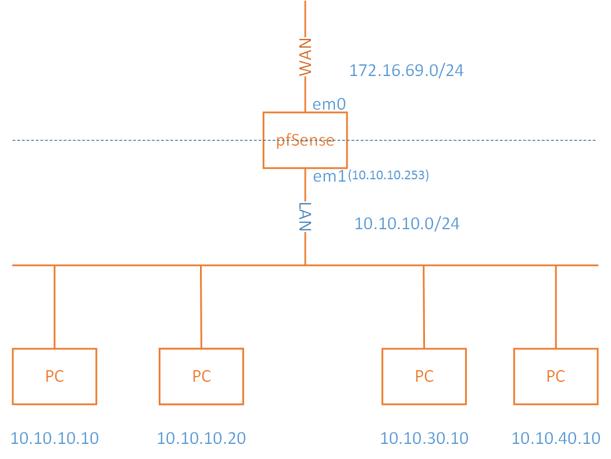

    - Các bước thực hiện lần lượt được thực hiện như sau:

        + Bước 1: Thực hiện enable DHCP Server. Điều này là cần thiết nếu như ta cung cấp sử dụng tính năng kết hợp với Wi-Fi cho các thiết bị không dây và tránh trường hợp các thiết bị sử dụng có địa chỉ IP giống nhau gây phát sinh lỗi. Tại giao diện Web Interface quản lý của pfSense. Ta chọn `Services` rồi chọn `DHCP Server`. Hãy thực hiện điền thông tin tương tự như hình dưới sau đó chọn `Save` để lưu lại cấu hình.
            
            > 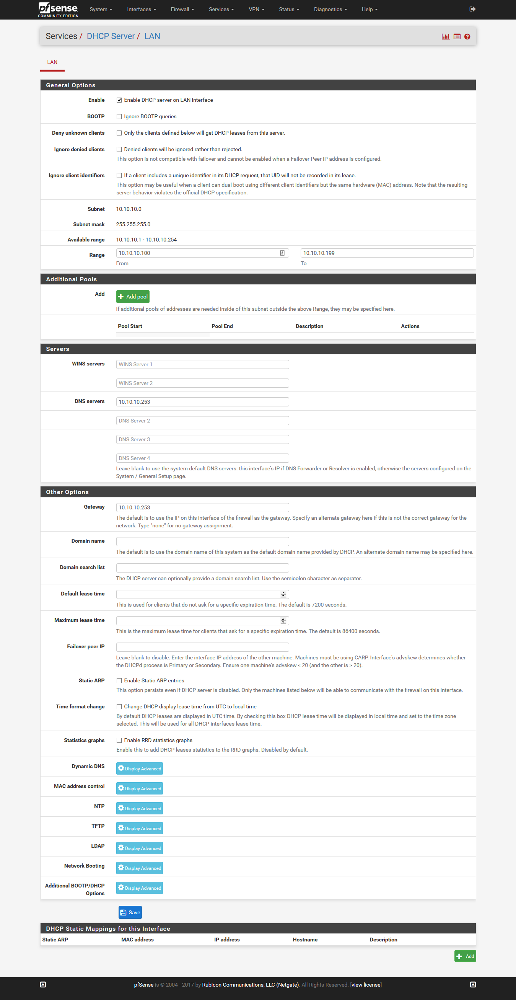

            trong đó:

                - `10.10.10.253` là địa chỉ IP của pfSense trong LAN
                - `10.10.10.100 - 10.10.10.199` là dải địa chỉ IP tự động cấp cho người dùng khi kết nối

        + Bước 2: Tạo tài khoản người dùng cung cấp cho người sử dụng có thể xác thực để truy cập internet. Cách thực hiện như sau:

            + Chọn `System`, sau đó chọn `User Manager`, tiếp tục chọn `Add` rồi nhập thông tin giống như hình sau:

               > 

                trong đó, tên `Username`, `Password` và `Confirm Password` để là `guest`.

            + Chọn `Save` để lưu lại thông tin

        + Bước 3. Cấu hình `Captive Portal` bằng các thực hiện như sau:

            + Chọn `Services`, tiếp tục chọn `Captive Portal` sau đó chọn `Add`. Nhập thông tin tương tự như hình sau để tạo ra `Captive Portal` Zone:

                > 

            + Chọn `Save & Continue` để lưu lại thông tin.

            + Tiếp tục nhập thông tin tương tự như hình dưới đây:

                > 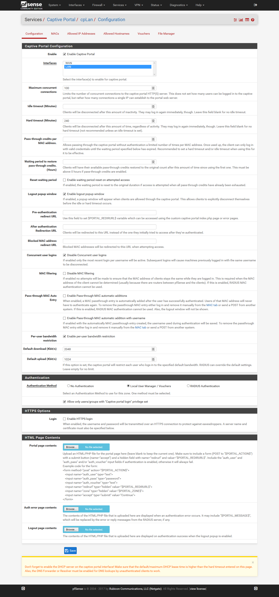

                trong đó:
                
                - `Maximum concurrent connections`: chỉ số lượng người dùng có thể kết nối đồng thời. Ở đây là 100 người.
                - `Hard timeout (Minutes)`: chỉ thời gian người dùng sẽ tự động bị ngắt kết nối. Ở đây là 240 phút, nếu không muốn dùng tính năng này thì để trống không nhập giá trị nào cả.
                - `Logout popup window`: Cho phép một cửa sổ hiện lên để người dùng có thể tự ngắt kết nối.
                - `Concurrent user logins`: Quy định tài khoản người dùng chỉ có thể đăng nhập trên một thiết bị vào cùng một thời điểm. Nếu trong một thời điểm mà có nhiều hơn một tài khoản cùng `Username` được đăng nhập thì thiết bị trước đó sẽ được tự động ngắt kết nối.
                - `Per-user bandwidth restriction`: Giới hạn băng thông người dùng. Ở đây, ta giới hạn tốc độ `Download` là `2048 Kb/s` và `Upload` là `1024 Kb/s` cho người dùng.
                - `Authentication Method`: Quy định cách thức xác thực người dùng sử dụng Internet. Ở đây ta chọn `Local User Manager / Vouchers` quy định người dùng phải có tài khoản tương tự như `Bước 2` ta đã tạo thì mới có thể sử dụng Internet. Chọn `No Authentication` nếu như không cần thiết quá trình xác thực người dùng phải xảy ra.
                - Tại mục `Authentication`, ta có thấy dòng nội dung "Allow only users/groups with "Captive portal login" privilege set". Hãy bỏ tích ở ô vuông nếu như bạn muốn tất cả mọi người sử dụng đều có thể sử dụng tính năng `Captive Portal` để có thể truy cập internet. Ngược lại, khi nội dung này được tích, ta cần phải cấp quyền cho người dùng.

                    > 

            + Chọn `Save` để lưu lại cấu hình. Kết quả ta thu được:

                > 

            + Để cấp quyền cho người dùng sử dụng tính năng `Captive Portal`, ta thực hiện như sau:

                + Bước 1. Chọn menu `System`, sau đó chọn `User Manager`. Tại đây, ta sẽ thực hiện cấp quyền cho người dùng có `Username` là `guest` đã tạo ra trước đó. Nhấp double vào dòng người dùng `guest`. Tại mục `Effective Privileges` ta thấy:

                    

                    chọn `Add` để thêm mới một quyền.

                + Bước 2. Tại đây, ta thấy được như sau:

                    > 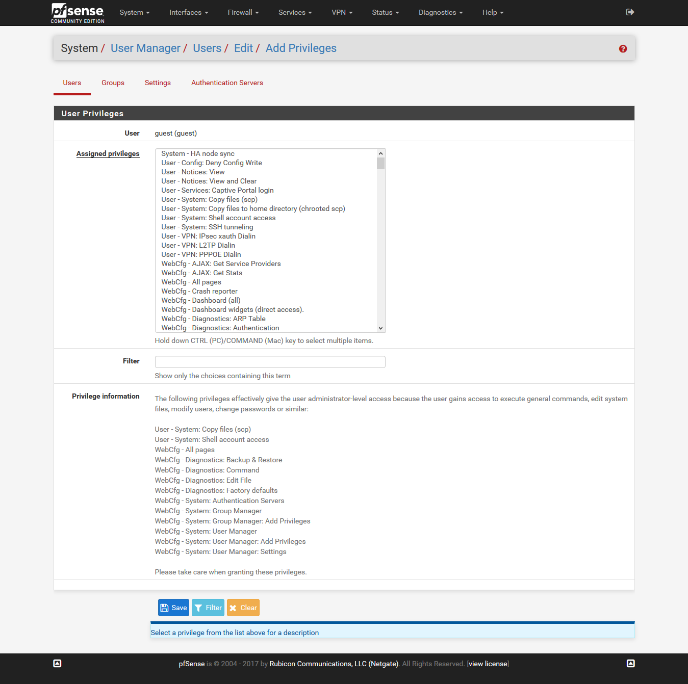

                    tìm tới `Filter` ta nhập `Captive Portal login` nhấn `Enter` để thực hiện tìm kiếm quyền. Sau đó nhấp chuột vào `User - Services: Captive Portal login` để chọn quyền:

                    > 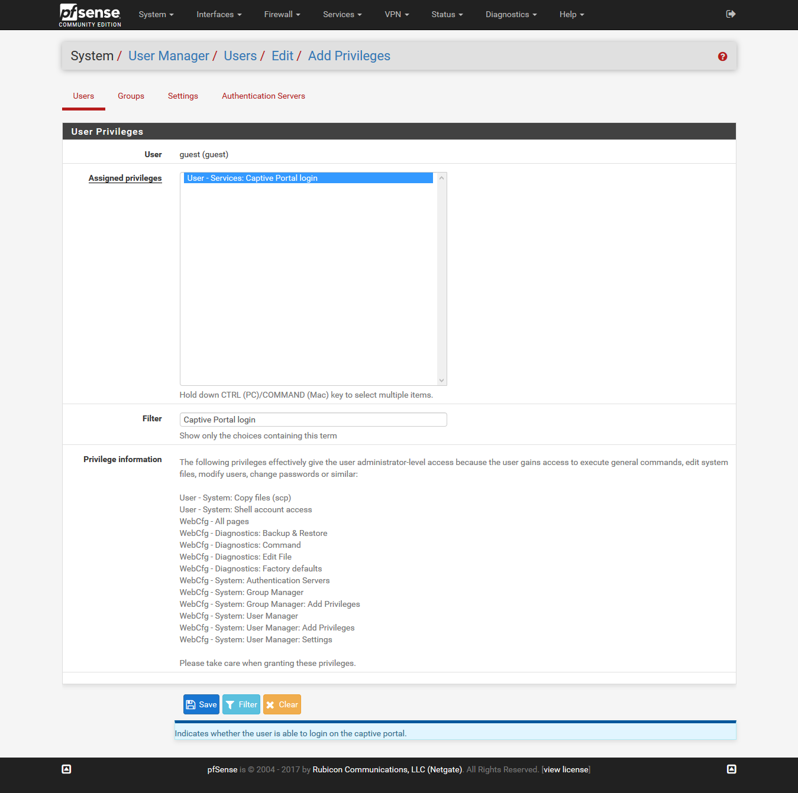

                    Sau đó chọn `Save` để lưu lại. Kết quả, ta nhận được:

                    > 

                    Tiếp tục chọn `Save` để lưu lại.

            + Về cơ bản, thì ta đã thực hiện cấu hình thành công đối với `Captive Portal`. Nhấp double chuột vào dòng `cpLan` để chỉnh sửa cấu hình nâng cao nếu như bạn muốn. Tại giao diện, ta sẽ thấy 3 tab là `Allowed IP Addresses` và `Allowed Hostnames`, `MACs`. Chức năng trong hai tab này là gì?

                > 

            + Thứ nhất, đối với tab `Allowed IP Addresses` ta có thể thực hiện quy định dải các địa chỉ IP hoặc các IP có thể tự do truy cập internet mà không cần phải trải qua quá trình xác thực và có thể thực hiện giới hạn băng thông đối với IP hay dải IP ta quy định. Thông thường, ta sẽ thực hiện cấu hình với từng địa chỉ IP nhiều hơn so với dải địa chỉ IP. Để thực hiện cấu hình, tại tab `Allowed IP Addresses` ta chọn `Add`. Nhập thông tin tương tự như hình sau:

                > 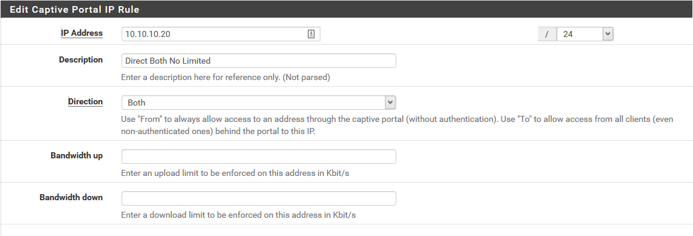

                trong hình, ta thực hiện cho phép thiết bị có địa chỉ IP `10.10.10.20/24` tự do truy cập Internet mà không cần phải xác thực. Không có giới hạn về băng thông đối với IP này.

            + Thứ hai, đối với tab `Allowed Hostnames` có chức năng tương tự như `Allowed IP Addresses` nhưng áp dụng đối với các `Hostnames` được sử dụng trong trường hợp thiết bị không sử dụng địa chỉ IP tĩnh vì vậy mà ta không thể biết được địa chỉ IP để của thiết bị mà cấu hình trong tab `Allowed IP Addresses`. Để thực hiện cấu hình, tại tab `Allowed Hostnames` ta chọn `Add`. Nhập thông tin tương tự như hình sau:

                > 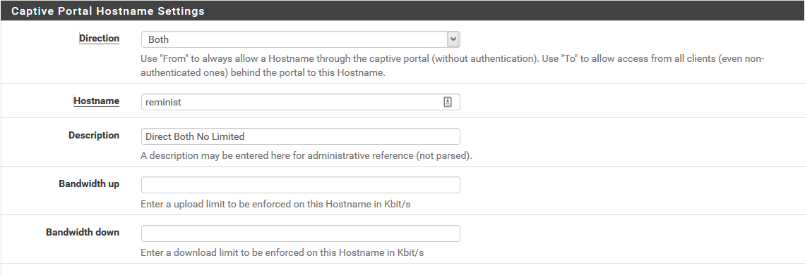

                trong hình, ta thực hiện cho phép thiết bị có tên là `reminist`  không cần phải xác thực khi truy cập internet.

            + Thứ ba, đối với tab `MACs`. có chức năng tương tự như `Allowed IP Addresses` nhưng áp dụng đối với MAC thay vì IP.

    - Lưu ý:

        + Để cấu hình thành công, các thiết bị khi kết nối phải xác thực, các thiết bị trong kết nối đến phải có DNS là địa chỉ của pfSense trong mạng LAN.

- ### <a name="checking">2.4 Kiểm tra kết quả</a>

    - Do việc thực hiện cấu hình được thực hiện qua VMWare. Nên ta sẽ thực hiện kiểm tra kết quả đối với một máy ảo có địa chỉ IP tĩnh là `10.10.10.10/24` với default gateway là `10.10.10.253` (IP của pfSense).

        > 

    - Thực hiện truy cập internet tới 1 website bất kỳ, ta thấy được như sau:

        > 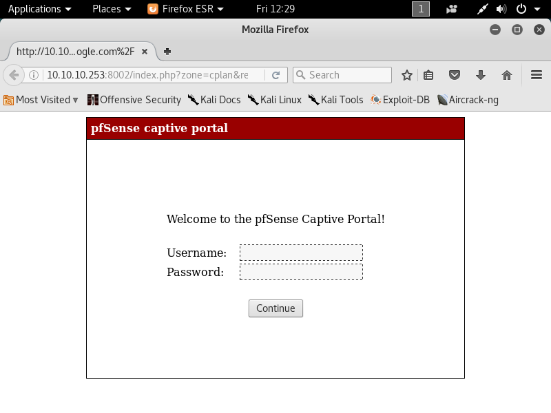

    - Nhập thông tin tài khoản người dùng mà ta đã tạo được ở `Bước 2`. Kết quả là client đã có thể truy cập internet.

        > 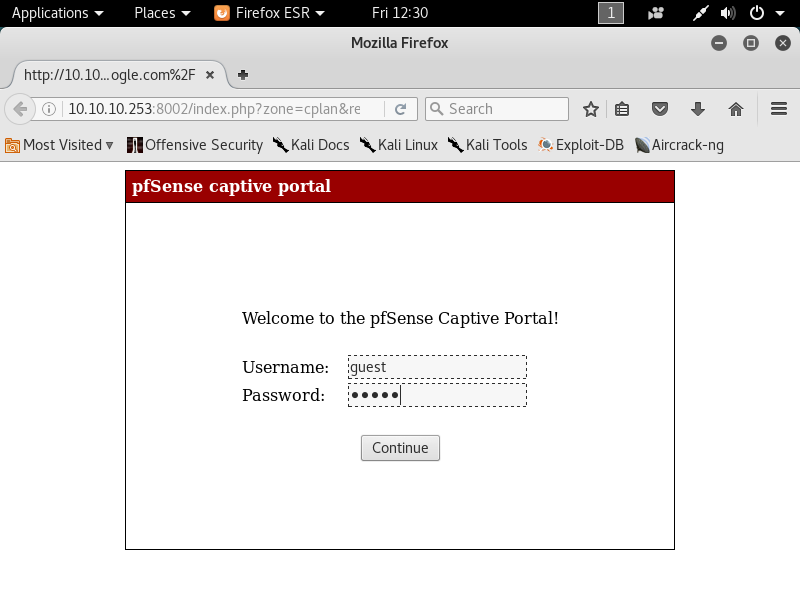

    - Tại giao diện Web Interface của pfSense ta có thể kiểm tra người dùng đang kết nối tới bằng cách chọn menu `Status`, sau đó chọn `Captive Portal`. Kết quả thu được như sau:

        > 
        

- ### <a name="voucher">2.5 Cấu hình Captive Portal xác thực người dùng sử dụng Voucher</a>

    - Xác thực người dùng trong Captive Portal sử dụng Voucher là quá trình cho phép người dùng trong LAN truy cập internet khi sở hữu một khóa - tương ứng với một ticket trong voucher mà không cần đến phải có tài khoản người dùng.

    - Để thực hiện cấu hình sử dụng voucher, ta bắt buộc phải làm các công việc cấu hình `Captive Portal` như bên trên (ngoại trừ việc tạo mới người dùng) trước tiên. Sau đó thực hiện cấu hình xác thực tài khoản người dùng như sau:

        + Bước 1. Tại giao diện `Captive Portal`, thực hiện nhấp double chuột vào `Captive Portal Zones` muốn sử dụng để cấu hình cho tính năng Voucher. Ví dụ ở đây là zone `cpLan`:

            > 

        + Bước 2. Ta chuyển sang tab `Vouchers`. Tích chọn vào `Enable the creation, generation and activation of rolls with vouchers` để sử dụng tính năng cho zone. Ta thấy được như sau:

            > 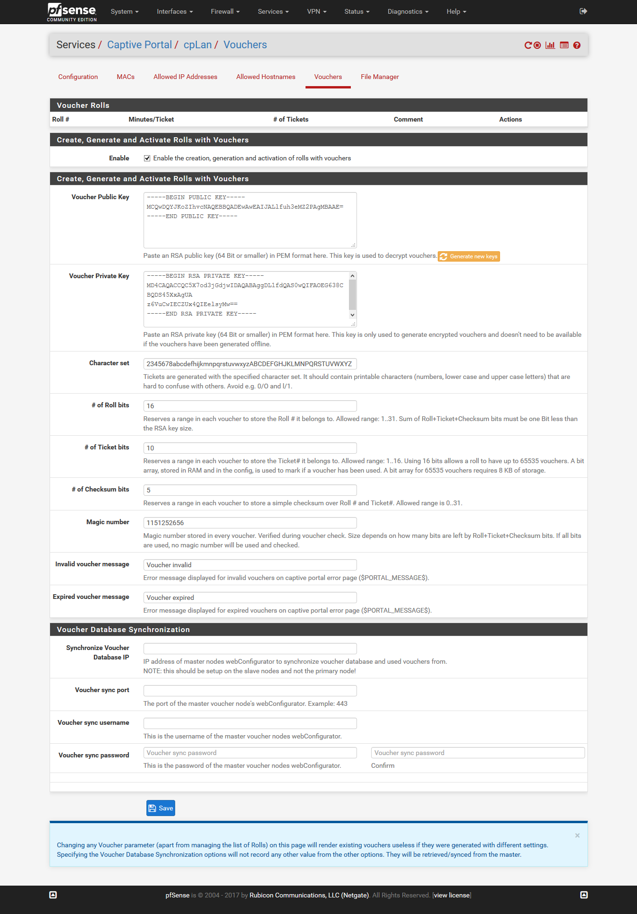

        + Tại mục `Character set`, ta thay đổi các giá trị sẵn có bởi giá trị sau:

                0123456789abcdefhijkmnpqrstuvwxyzABCDEFGHJKLMNPQRSTUVWXYZ!@#$%^&()._~

            đây là dãy các ký tự sẽ được sử dụng để sinh ra key - voucher.

        + Lần lượt thay các giá trị tương ứng giống với hình sau đây hoặc giữ nguyên hoặc thay đổi các giá trị sao cho tổng của 3 giá trị nhỏ hơn 64 một cách tùy ý:

            > 

            chọn `Save` để lưu lại.

        + Tiếp theo, ta cần phải tạo ra một `roll` chứa các ticket - là một chuỗi ký tự sẽ cung cấp cho người sử dụng để có thể truy cập internet thay vì ta cung cấp tài khoản. Tại phần `Voucher Rolls`, ta chọn `Add`:

            > 

        + Nhập các giá trị tương ứng giống như hình sau:

            > 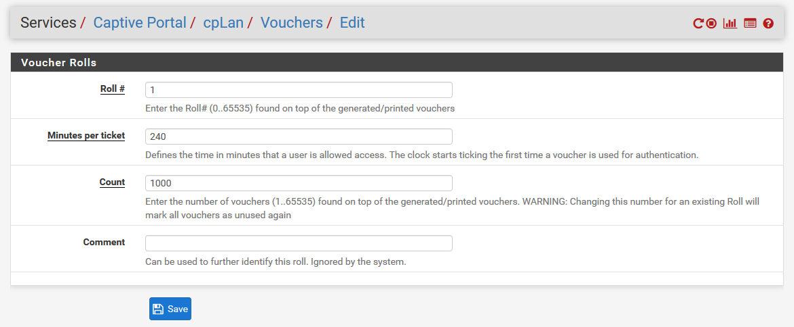

            trong đó:

            - `Roll`: Định danh cho roll.
            - `Minutes per ticket`: Quy định thời gian có hiệu lực của mỗi voucher đó kể từ khi nó được sử dụng. Ở đây là 240 phút.
            - `Count`: Quy định số voucher sẽ được tạo ra. Ở đây là 1000 voucher. Nếu như `of Ticket bits` ta đã cấu hình có giá trị là 16 thì số voucher có thể được sinh ra lên đến 65536 voucher.

            chọn `Save` để lưu lại, kết quả ta thu được tương tự như sau:

            > 

        + Export roll để có thể biết được thông tin về các voucher được tạo ra bằng việc thực hiện chọn `Export vouchers for this roll to a .csv file` tương ứng của mỗi roll:

            > 

            ta sẽ cần phải về một file *.csv có tên theo dạng "vouchers_zoneName_rollid.csv". Trong đó zoneName và rollid lần lượt là tên của Captive Portal Zone và định danh của roll.

        + Mở file đã download bằng `Microsoft Excel` hoặc các phần mềm soạn thảo khác như Notepad(Wordpad) đối với Windows hay Vim đối với Linux để có thể thu được giá trị của các voucher. Ta thu được kết quả tương tự như sau:

            > 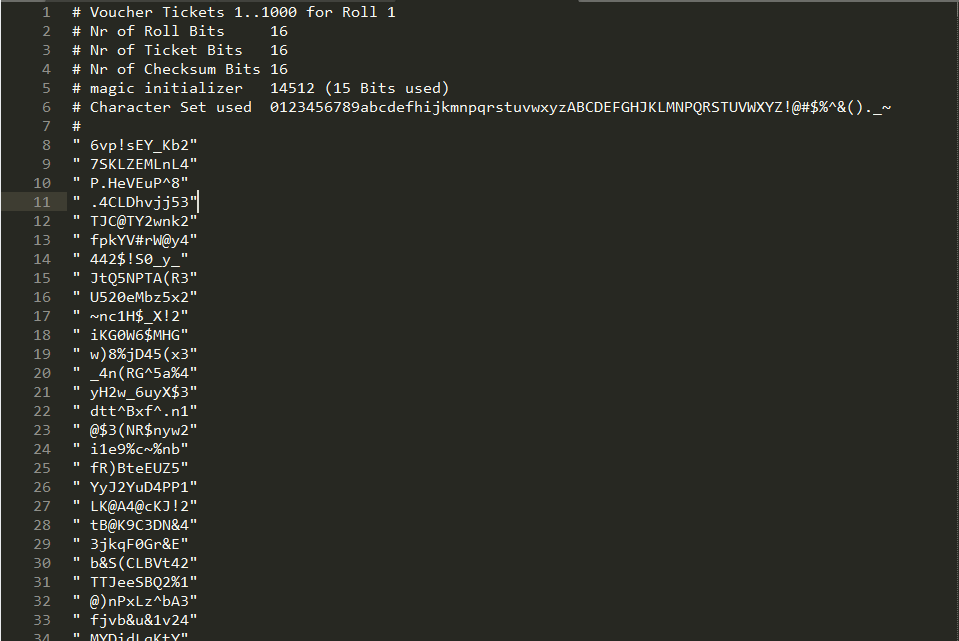

            ta thấy được các chuỗi voucher được quy định bắt đầu từ dòng thứ 8 cho đến hết. Mỗi voucher tương ứng với 1 dòng. Chúng sẽ được ta sử dụng để cung cấp cho người có nhu cầu sử dụng internet trong LAN.

        + Tiếp theo, cấu hình trang xác thực cho `Captive Portal`. Ta chuyển sang tab `Configuration` của zone để tiến hành cấu hình custom cho trang xác thực. Vì mặc định, trang xác thực chỉ cho phép người dùng xác thực bằng tài khoản. Cách thực hiện như sau:

            + Bước 1. Tiến hành download trang custom [tại đây](../files/sign-up-login-form/index.html).

            + Bước 2. Tại mục `Portal page contents`, ta chọn `Browser` sau đó thực hiện tìm chọn file `index.html` mà ta vừa download.

            + Bước 3. Chọn `Save` để lưu lại cấu hình.

        + Từ máy client có trỏ DNS tới địa chỉ của pfSense trong LAN, ta thực hiện truy cập tới 1 trang web nào đó sẽ yêu cầu phải xác thực. Ta chuyển sang tab `Voucher` sau đó nhập vào một voucher trong file export voucher đã download sau đó chọn `Log In` để kiểm tra kết quả:

            > 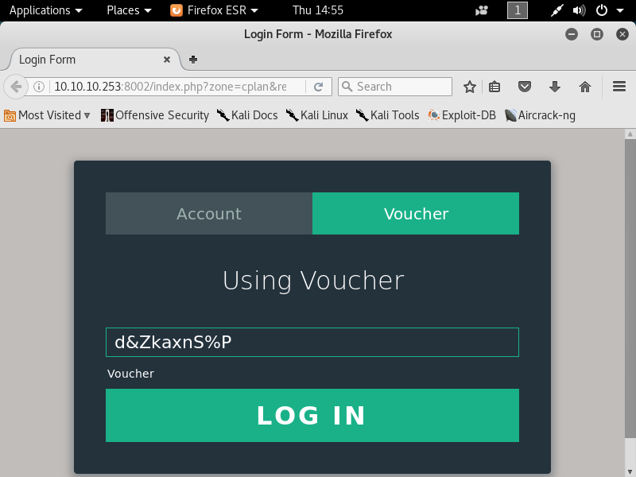

        Như vậy, ta đã hoàn hành quá trình cấu hình.
____

# <a name="content-others">Các nội dung khác</a>