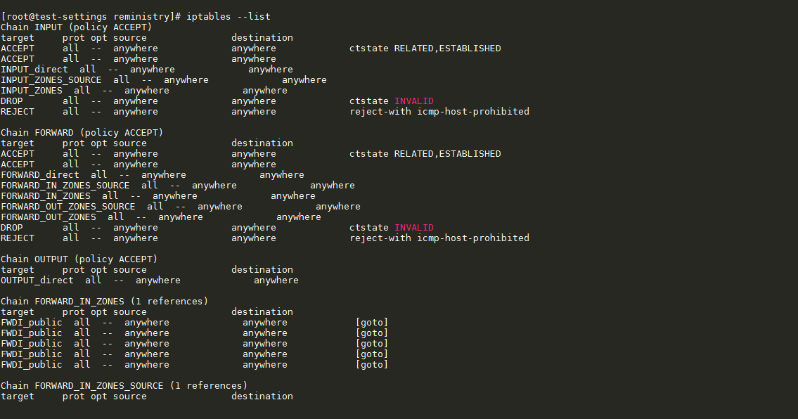

# 2. Cách sử dụng cơ bản về iptables

____

# Mục lục

- [2.1 Ý nghĩa một vài tham số tùy chọn trong câu lệnh iptables](#concept-options)
- [2.2 Xem rules và ý nghĩa các cột trong iptables](#watch-rules)
- [2.3 Các thao tác với chain trong iptables](#execute-chain)
- [2.4 Các thao tác với rule trong iptables](#execute-rule)
- [Các nội dung khác](#content-others)

____

# <a name="content">Nội dung</a>

- ### <a name="concept-options">2.1 Ý nghĩa một vài tham số tùy chọn trong câu lệnh iptables</a>
- ### <a name="watch-rules">2.2 Xem rules và ý nghĩa các cột trong iptables</a>

    - Để xem các rule hiện có trong `iptables` ta sử dụng câu lệnh sau:

            iptables --list

        kết quả sẽ hiển thị tương tự như sau:

        > 

        nhìn vào kết quả trên, ta có thể thấy được nội dung với các cột như sau:

        - `target`: Thể hiện giá trị của `target` bao gồm các giá trị: ACCEPT, DROP, REJECT, RETURN, LOG ...
        - `prot`: Quy định protocol của rule được match với rule. chúng bao gồm các protocol có trong `/etc/protocols`.
        - `opt`:
        - `source`:
        - `destination`:

        mỗi một dòng sau `target     prot opt source               destination` được xem là một rule trong 1 `chain`, và `Chain INPUT (policy ACCEPT)` biểu thị `chain` có tên là `INPUT` và `policy` của `chain` là `ACCEPT` và `1 references` biểu thị số lượng `chain` có liên quan đến `chain` này. Điều này đúng cho thông tin của các chain.

    - 

- ### <a name="execute-chain">2.3 Các thao tác với chain trong iptables</a>
- ### <a name="execute-rule">2.4 Các thao tác với rule trong iptables</a>

____

# <a name="content-others">Các nội dung khác</a>
