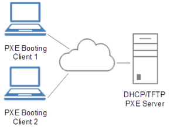
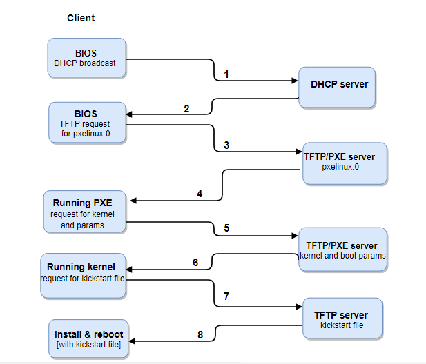

# TỔNG QUAN VỀ PXE VÀ KICKSTART

###	***Mục lục***

[1.	PXE là gì?](#1)

- [1.1. Giới thiệu PXE](#1.1)

- [1.2. PXE workflow](#1.2)

[2.	Kickstart là gì?](#2)

[3. Tham khảo](#3)
---

# 1.	PXE là gì?

## 1.1. Giới thiệu PXE

- **Preboot eXecution Environment** - PXE là một chuẩn công nghiệp mở được phát triển bởi một số các nhà sản xuất phần mềm và phần cứng. Được thiết kế ban đầu bởi Intel, cùng với sự tham gia của các nhà sản xuất như HP, 3Com, Dell, Compaq, and Phoenix Technologies. PXE làm việc với network card (NIC) trong PC, biến NIC thành một boot device. PXE boot hệ điều hành cho các PC từ network bằng cách lấy một "boot image" từ server. File này có thể là một OS hay pre-OS cho PC. Bởi PXE làm việc cùng với NIC nên yêu cầu NIC phải có PXE-enable. Bạn cũng có thể gắn một con chip boot ROM PXE vào NIC.

- PXE là một môi trường cho phép khởi động máy tính bằng việc sử dụng card mạng cùng với RAM. Việc khởi động đó sẽ không phụ thuộc vào những thiết bị của máy tính như CD, harddisk và các hệ điều hành đã được cài đặt.

- PXE bao gồm 2 thành phần: PXE Client và PXE Server. Thành phần PXE Client (PXE boot code) nằm trên card mạng. Các server, laptop hầu hết đều cho phép khởi động máy tính qua mạng với PXE boot code. Các mainboard có card mạng onboard cũng hầu hết có thành phần này. Card mạng có PXE boot code cũng được coi là một thiết bị khởi động giống như các thiết bị khởi động khác: ổ mềm, ổ cứng, ổ CD/DVD, ổ USB. PXE Server là phần mềm chạy trên một máy tính nào đó trong mạng LAN. Phần mềm này hỗ trợ các giao thức TFTP, DHCP.

	

- Trong đó:

	-	Dịch vụ DHCP có nhiệm vụ cấp phát địa chỉ IP để các máy client có thể liên lạc với các máy khác và với TFTP server để lấy các file boot và file cấu hình cần thiết.

	-	Dịch vụ TFTP cung cấp dịch vụ truyền các file boot và file cấu hình cần thiết cho Client.

- Có thể xây dựng PXE Server để cung cấp việc cài đặt hệ điều hành Windows /Linux cho các máy tính mà không cần đĩa CD/DVD theo cách thức cài đặt truyền thống, hoặc cũng có thể xây dựng một mạng hoạt động không cần ổ cứng.

- Khi máy tính gặp sự cố không khởi động được, người ta thường nghĩ đến các đĩa CD/DVD hoặc USB có thể khởi động được để khắc phục sự cố, phục hồi dữ liệu. Có một giải pháp khá hiệu quả là xây dựng một PXE Server trên một máy tính khác trong cùng mạng LAN và trên máy gặp sự cố, sẽ khởi động bằng card mạng và truy cập vào PXE Server để sử dụng các chương trình được cài sẵn trên đó. Bài viết này sẽ hướng dẫn cách thức xây dựng một PXE Server với nhiều lựa chọn khi khởi động để hỗ trợ người quản trị khắc phục các máy tính khi gặp sự cố.

- Sau đây là một ví dụ minh họa menu lựa chọn khi khởi động:

	

## 1.2. PXE workflow

- PXE làm việc với card mạng (NIC) của hệ thống bằng cách làm cho chúng có chức năng như một boot device. PXE kích hoạt trên NIC của client sẽ gửi đi bản tin request tới DHCP server, để lấy được địa chỉ IP của nó và IP của máy chủ TFTP server, và vị trí các file boot trên TFTP server.   
- Workflow của PXE gồm những bước sau: 

	

	- 1) Máy client được khởi động (bật nguồn). NIC của client gửi đi bản tin broadcast để tìm DHCP server.  
	- 2) DHCP server nhận được bản tin của client và gửi lại các thông tin cần thiết cho client (IP, subnet mask, gateway, DNS ...). Và cung cấp cho client thông tin về vị trí của TFTP server và boot image (pxelinux.0 - đây là file chứa các mã lệnh để cho biết loại kernel mà hệ thống sẽ boot).  
	- 3) Khi client nhận được các thông tin này, nó sẽ liên lạc với TFTP server để lấy boot image.
	- 4) TFTP server gửi lại boot image (pxelinux.0), và client sẽ sử lý nó. 
	- 5) Mặc định, boot image tìm được thư mục pxelinux.cfg trên TFTP server để lấy các file cấu hình. Các tiêu chí tìm được file cấu hình như sau: 
		- 	Đầu tiên, nó tìm file cấu hình trong quá trình cài đặt mà tên file được đặt theo địa chỉ MAC của client được viết dưới dạn chữ viết thường hệ hexa phân cách bởi dấu gạch ngang. Ví dụ, cho client có đại chỉ MAC: "88:99:AA:BB:CC:DD", client sẽ tìm file cấu hình tên: 01-88-99-aa-bb-cc-dd.
		- SAu đó, nó sẽ tìm  file cấu hình theo địa chỉ IP, được biểu diễn dưới mã hexa đại diện cho IP. Ví dụ, client có đại chỉ IP là 192.0.2.91 sẽ tìm file cấu hình tên C000025B.
		Nếu không có file nào được tìm thấy, nó sẽ loại dần các chữ cái từ cuối cho đến hết để tìm ra file cấu hình cho nó. Tuy nhiên, nếu đến cuối cùng, khi đã loại bỏ hết các kí tự rồi mà không tìm thấy, nó sẽ sử dụng file cấu hình mặc định là file "default"
		-  Ví dụ, nếu file boot tên là `/tftpboot/pxelinux.0`, địa chỉ MAC của client là `88:99:AA:BB:CC:DD`,và địa chỉ IP là 192.0.2.91, thì boot image của client sẽ tìm các file cấu hình theo thứ tự như sau: 
			-	`/tftpboot/pxelinux.cfg/01-88-99-aa-bb-cc-dd`
			-	`/tftpboot/pxelinux.cfg/C000025B`
			-	`/tftpboot/pxelinux.cfg/C000025`
			-	`/tftpboot/pxelinux.cfg/C00002`
			-	`/tftpboot/pxelinux.cfg/C0000`
			-	`/tftpboot/pxelinux.cfg/C000`
			-	`/tftpboot/pxelinux.cfg/C00`
			-	`/tftpboot/pxelinux.cfg/C0`
			-	`/tftpboot/pxelinux.cfg/C`

	- 6, 7, 8) Client doownload tất cả các file cần thiết (filesystem, kickstart, ...) và tải về. 

- Cuối cùng, Client  install và reboot.

# 2.	Kickstart là gì?

- Nhiều quản trị viên hệ thống thích sử dụng phương pháp tự động cài đặt hệ điều hành, như Ubuntu, trên các máy của họ. Tính năng chèn sẵn các thông tin cấu hình đòi hỏi trong quá trình cài đặt đã có sẵn từ phiên bản Ubuntu 5.04. Tuy nhiên, một số người muốn triển khai các mạng bao gồm nhiều bản phân phối khác nhau của Linux. Công cụ Kickstart của Red Hat đáp ứng được nhu cầu này. Mục đích của Kickstart là khả năng tương thích của nó cho phép Kickstart được sử dụng như một lớp đầu tiên, chứa các thông tin cấu hình cần thiết hoặc tùy thích theo ý của người dùng đối với quá trình cài đặt hệt thống. 

- Sử dụng Kickstart, một quản trị viên hệ thống có thể tạo ra một tập tin chứa các câu trả lời cho tất cả các câu hỏi thông thường được yêu cầu trong quá trình cài đặt Ubuntu.

- Các file Kickstart có thể được lưu trong một server riêng biệt (thường trong cùng PXE hoặc TFTP server), và có thể lấy được bởi bất kì máy tình nào trong suốt quá trình máy đó cài đặt. 
Phương pháp cài đặtnày hỗ trợ sử dụng một file Kickstart để cài đặt Ubuntu trên nhiều máy Client khác nhau, là phương pháp tuyệt với cho các nhà quản trị mạng và hệ thống cấu hình mô hình mạng theo ý muốn của mình.

- Kickstart cho phép bạn cấu hình tự động các thông tin trong suốt quá trình cài đặt Ubuntu, như:

-	Lựa chọn ngôn ngữ
	-	Cấu hình cho mouse  
	-	Cấu hình keyboard  
	-	Cài đặt boot loader  
	-	Phân vùng ổ cứng.  
	-	Cấu hình mạng  
	-	Cấu hình các gói phần mềm cần thiết  
	-	Cấu hình hệ thống X Window.   
	-	Chạy script tạo sẵn sau khi cài đặt xong hệ thống.  
	-	…   

- Các tùy chọn trong file Kickstart tham khảo thêm [tại đây.](https://access.redhat.com/documentation/en-US/Red_Hat_Enterprise_Linux/6/html/Installation_Guide/s1-kickstart2-options.html) 

# 3. Tham khảo

[1] http://v0danh.blogspot.com/2011/10/khoi-ong-may-tinh-tu-pxe.html  
[2] https://en.wikipedia.org/wiki/Preboot_Execution_Environment   
[3] configuration kickstart: https://access.redhat.com/documentation/en-US/Red_Hat_Enterprise_Linux/6/html/Installation_Guide/ch-kickstart2.html   

