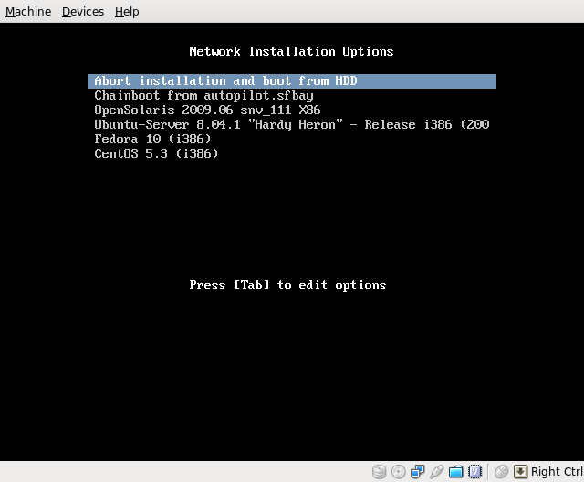

# TỔNG QUAN VỀ PXE VÀ KICKSTART

###	***Mục lục***

[1.	PXE là gì?](#1)

[2.	Kickstart là gì?](#2)

[3. Tham khảo](#3)
---

# 1.	PXE là gì?

- **Preboot eXecution Environment** - PXE là một chuẩn công nghiệp mở được phát triển bởi một số các nhà sản xuất phần mềm và phần cứng. Được thiết kế ban đầu bởi Intel, cùng với sự tham gia của các nhà sản xuất như HP, 3Com, Dell, Compaq, and Phoenix Technologies. PXE làm việc với network card (NIC) trong PC, biến NIC thành một boot device. PXE boot hệ điều hành cho các PC từ network bằng cách lấy một "boot image" từ server. File này có thể là một OS hay pre-OS cho PC. Bởi PXE làm việc cùng với NIC nên yêu cầu NIC phải có PXE-enable. Bạn cũng có thể gắn một con chip boot ROM PXE vào NIC.

- PXE là một môi trường cho phép khởi động máy tính bằng việc sử dụng card mạng cùng với RAM. Việc khởi động đó sẽ không phụ thuộc vào những thiết bị của máy tính như CD, harddisk và các hệ điều hành đã được cài đặt.

- PXE bao gồm 2 thành phần: PXE Client và PXE Server. Thành phần PXE Client (PXE boot code) nằm trên card mạng. Các server, laptop hầu hết đều cho phép khởi động máy tính qua mạng với PXE boot code. Các mainboard có card mạng onboard cũng hầu hết có thành phần này. Card mạng có PXE boot code cũng được coi là một thiết bị khởi động giống như các thiết bị khởi động khác: ổ mềm, ổ cứng, ổ CD/DVD, ổ USB. PXE Server là phần mềm chạy trên một máy tính nào đó trong mạng LAN. Phần mềm này hỗ trợ các giao thức TFTP, DHCP.

	

- Trong đó:

	-	Dịch vụ DHCP có nhiệm vụ cấp phát địa chỉ IP để các máy client có thể liên lạc với các máy khác và với TFTP server để lấy các file boot và file cấu hình cần thiết.

	-	Dịch vụ TFTP cung cấp dịch vụ truyền các file boot và file cấu hình cần thiết cho Client.

- Có thể xây dựng PXE Server để cung cấp việc cài đặt hệ điều hành Windows /Linux cho các máy tính mà không cần đĩa CD/DVD theo cách thức cài đặt truyền thống, hoặc cũng có thể xây dựng một mạng hoạt động không cần ổ cứng.

- Khi máy tính gặp sự cố không khởi động được, người ta thường nghĩ đến các đĩa CD/DVD hoặc USB có thể khởi động được để khắc phục sự cố, phục hồi dữ liệu. Có một giải pháp khá hiệu quả là xây dựng một PXE Server trên một máy tính khác trong cùng mạng LAN và trên máy gặp sự cố, sẽ khởi động bằng card mạng và truy cập vào PXE Server để sử dụng các chương trình được cài sẵn trên đó. Bài viết này sẽ hướng dẫn cách thức xây dựng một PXE Server với nhiều lựa chọn khi khởi động để hỗ trợ người quản trị khắc phục các máy tính khi gặp sự cố.

- Sau đây là một ví dụ minh họa menu lựa chọn khi khởi động:

	

# 2.	Kickstart là gì?

- Nhiều quản trị viên hệ thống thích sử dụng phương pháp tự động cài đặt hệ điều hành, như Ubuntu, trên các máy của họ. Tính năng chèn sẵn các thông tin cấu hình đòi hỏi trong quá trình cài đặt đã có sẵn từ phiên bản Ubuntu 5.04. Tuy nhiên, một số người muốn triển khai các mạng bao gồm nhiều bản phân phối khác nhau của Linux. Công cụ Kickstart của Red Hat đáp ứng được nhu cầu này. Mục đích của Kickstart là khả năng tương thích của nó cho phép Kickstart được sử dụng như một lớp đầu tiên, chứa các thông tin cấu hình cần thiết hoặc tùy thích theo ý của người dùng đối với quá trình cài đặt hệt thống. 

- Sử dụng Kickstart, một quản trị viên hệ thống có thể tạo ra một tập tin chứa các câu trả lời cho tất cả các câu hỏi thông thường được yêu cầu trong quá trình cài đặt Ubuntu.

- Các file Kickstart có thể được lưu trong một server riêng biệt (thường trong cùng PXE hoặc TFTP server), và có thể lấy được bởi bất kì máy tình nào trong suốt quá trình máy đó cài đặt. 
Phương pháp cài đặtnày hỗ trợ sử dụng một file Kickstart để cài đặt Ubuntu trên nhiều máy Client khác nhau, là phương pháp tuyệt với cho các nhà quản trị mạng và hệ thống cấu hình mô hình mạng theo ý muốn của mình.

- Kickstart cho phép bạn cấu hình tự động các thông tin trong suốt quá trình cài đặt Ubuntu, như:

-	Lựa chọn ngôn ngữ
	-	Cấu hình cho mouse  
	-	Cấu hình keyboard  
	-	Cài đặt boot loader  
	-	Phân vùng ổ cứng.  
	-	Cấu hình mạng  
	-	Cấu hình các gói phần mềm cần thiết  
	-	Cấu hình hệ thống X Window.   
	-	Chạy script tạo sẵn sau khi cài đặt xong hệ thống.  
	-	…   

- Các tùy chọn trong file Kickstart tham khảo thêm [tại đây.](https://access.redhat.com/documentation/en-US/Red_Hat_Enterprise_Linux/6/html/Installation_Guide/s1-kickstart2-options.html) 

# 3. Tham khảo

[1] http://v0danh.blogspot.com/2011/10/khoi-ong-may-tinh-tu-pxe.html  
[2] https://en.wikipedia.org/wiki/Preboot_Execution_Environment   
[3] configuration kickstart: https://access.redhat.com/documentation/en-US/Red_Hat_Enterprise_Linux/6/html/Installation_Guide/ch-kickstart2.html   

