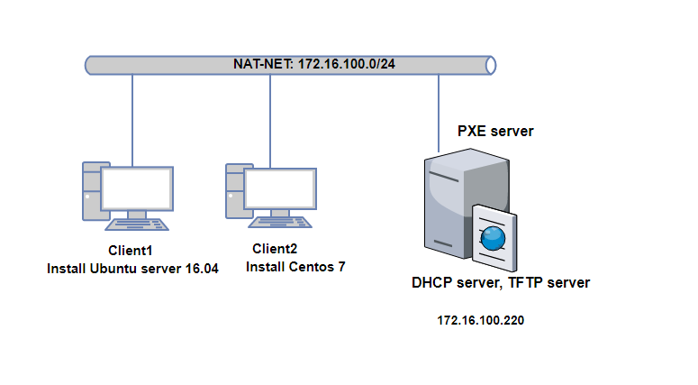
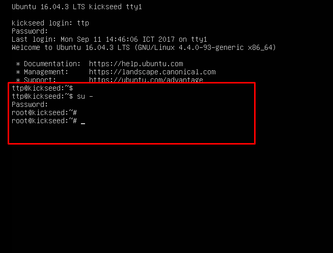

# LAB PXE - KICKSTART

###	***Mục lục***

[1.	Mô hình và chuẩn bị](#)

[2.	Cài đặt và cấu hình DHCP server](#)

[3.	Cài đặt và cấu hình TFTP server](#)

[4.	Cấu hình PXE và kickstart](#)

- [4.1.	Cấu hình kickstart](#)

- [4.2.	Cấu hình PXE](#)

[5.	Client boot OS từ PXE](#)

[6.	Tham khảo](#)

---

Mục đích bài lab: Hiểu và thiết lập mô hình boot OS cho các client thông qua network.

<a name = '1'></a>
# 1.	Mô hình và chuẩn bị



- Để sử dụng PXE bạn cần cài đặt hệ thống PXE boot-server mà cho phép client:

	- Request một địa chỉ IP (thông qua DHCP)

	- Download kernel (thông qua TFTP, vì giao thức này có thể bỏ qua quá trình xác thực, các máy chưa được cài Hệ điều hành sẽ không đáp ứng được yêu cầu xác thực)

- **Chuẩn bị**: Phần này thực hiện lab trên môi trường máy ảo Vmware workstation 12. Các máy ảo cấu hình như sau:  
	-	Máy server: Ubuntu server 16.04 cài các dịch vụ DHCP server và TFTP server. Có NIC dải NAT-NET, địa chỉ 172.16.100.220  
	-	Các máy client card mạng hỗ trợ PXE. Có ít nhất một card mạng dải NAT-NET

Sau đây là các bước cấu hình:

<a name = '2'></a>
# 2.	Cài đặt và cấu hình DHCP server 

### Cài đặt gói phần mềm DHCP server cho máy server: 

`apt-get install isc-dhcp-server  -y`

### Cấu hình

- Sửa file `/etc/deefault/isc-dhcp-server` để cấp DHCP qua card ens33 (của máy server)

	`INTERFACES="ens33"`

- Cấu hình dải DHCP mà server cấp phát: sửa file `/etc/dhcp/dhcpd.conf` 

	- Bỏ comment dòng sau:
		`authoritative;`

	- Thêm các dòng sau vào cuối file để cấp phát cho dải mạng: 

		```
		subnet 172.16.100.0 netmask 255.255.255.0 {
		range 172.16.100.200 172.16.100.220;
		option domain-name-servers 8.8.8.8;
		option routers 172.16.100.1;
		option broadcast-address 172.16.100.255;
		default-lease-time 600;
		max-lease-time 7200;
		}
		```

- Cấu hình các thông tin sau cho PXE boot server: (thêm vào cuối file /etc/dhcp/dhcpd.conf)

	```
	allow booting;
	allow bootp;
	option option-128 code 128 = string;
	option option-129 code 129 = text;
	next-server 172.16.100.220; #IP cua TFTP server
	filename "pxelinux.0";
	```

- Khởi động lại dịch vụ DHCP để áp dụng thông tin vừa cấu hình: 

	`service isc-dhcp-server restart`

<a name = '3'></a>
# 3.	Cài đặt và cấu hình TFTP server 

### Cài đặt các gói phần mềm cần thiết cho TFTP server:

`apt-get install ftpd-hpa inetutils-inetd -y`

### Cấu hình: 

- Sửa file 	`/etc/default/tftpd-hpa` chèn vào cuối dòng trên các dòng dưới

	```
	RUN_DAEMON="yes"
	OPTIONS="-l -s /var/lib/tftpboot"
	```


- Sửa file `/etc/inetd.conf`, thêm vào cuối cùng dòng sau:

	`tftp    dgram   udp    wait    root    /usr/sbin/in.tftpd /usr/sbin/in.tftpd -s /var/lib/tftpboot`

- Cấu hình thêm các file boot vào TFTP server: 

	- Tạo thư mục chứa các file boot TFTP: 

		`mkdir -p /var/lib/tftpboot/`

	- Download các gói Image netboot cần thiết để cài đặt Ubuntu 16.04 64 bit từ Internet như sau: 

		```
		wget http://archive.ubuntu.com/ubuntu/dists/xenial-updates/main/installer-amd64/current/images/netboot/ldlinux.c32
		wget http://archive.ubuntu.com/ubuntu/dists/xenial-updates/main/installer-amd64/current/images/netboot/pxelinux.0
		wget --recursive http://archive.ubuntu.com/ubuntu/dists/xenial-updates/main/installer-amd64/current/images/netboot/ubuntu-installer/ --no-parent
		cd archive.ubuntu.com/ubuntu/dists/xenial-updates/main/installer-amd64/current/images/netboot/ubuntu-installer
		mv ubuntu-installer /var/lib/tftpboot/
		cd /var/lib/tftpboot/
		rm -rf archive.ubuntu.com
		```

- Khởi động lại dịch vụ TFTP server: 
	
	`service tftpd-hpa restart`

<a name = '4'></a>
# 4.	Cấu hình PXE và kickstart

<a name = '4.1'></a>
## 4.1.	Cấu hình kickstart

- Cài đặt apache2 để các máy client có thể download file kickstart thông qua HTTP: 

	`apt-get install apache2 -y`

- Tạo file kickstart có nội dung tùy chỉnh như sau:

	```
	# set language to use during installation
	lang en_US
	langsupport en_US

	# set keyboard layout for the system
	keyboard us

	# reboot the system after installation
	reboot
	# config repo source.list
	url --url http://vn.archive.ubuntu.com/ubuntu/

	# Sets up the authentication options for the system.
	auth --useshadow --enablemd5

	bootloader --location=mbr

	zerombr yes

	clearpart --all

	# setup timezone
	timezone Asia/Ho_Chi_Minh

	# Set the system's root password
	rootpw rootpassword123

	# Creates a new user on the system
	user ttp --fullname=ttp --password=ttppassword123
	# create partition on the system with LVM
	part pv.01 --size 1 --grow

	volgroup ubuntu pv.01
	logvol swap --fstype swap --name=swap --vgname=ubuntu --size 1024
	logvol / --fstype ext4 --vgname=ubuntu --size=1 --grow --name=slash

	# hack around Ubuntu kickstart bugs
	preseed partman-lvm/confirm_nooverwrite boolean true
	preseed partman-auto-lvm/no_boot boolean true

	# Configures network information

	network --bootproto=dhcp --device=ens34 --active
	network --bootproto=dhcp --device=ens33 --active

	# Do not configure the X Window System
	skipx

	## Install packet for the system
	%packages  --ignoremissing
	@ ubuntu-server
	openssh-server

	## Run script after installation
	%post
	apt-get update -y && apt-get upgrade -y
	```

	- Lưu file lại với tên `kickstartForUS16.04.cfg` 

	- Chuyển file `kickstartForUS16.04.cfg` vào thư mục web root như sau: 

		`mv kickstartForUS16.04.cfg /var/www/html/`

<a name = '4.2'></a>
## 4.2.	Cấu hình PXE

- Sửa file `/var/lib/tftpboot/pxelinux.cfg/default` để khai báo menu của PXE boot, nội dung giống như sau:

	```
	# D-I config version 2.0
	# search path for the c32 support libraries (libcom32, libutil etc.)
	path ubuntu-installer/amd64/boot-screens/
	include ubuntu-installer/amd64/boot-screens/menu.cfg
	default ubuntu-installer/amd64/boot-screens/vesamenu.c32
	DISPLAY boot.txt

	DEFAULT Ubuntu_server_16.04_Install

	LABEL Ubuntu_server_16.04_Install
	        kernel ubuntu-installer/amd64/linux
	        append ks=http://172.16.100.220/kickstartForUS16.04.cfg ksdevice=ens33 vga=normal initrd=ubuntu-installer/amd64/initrd.gz --

	prompt 0
	timeout 0
	```

- Trong đó, cấu hình ksdevice để chỉ tới NIC của client (ở đây biết tên của NIC của client là `ens33`) dùng để setup hệ thống.

<a name = '5'></a>
# 5.	Client boot OS từ PXE

- Tạo một máy ảo Client mới chưa setup hệ điều hành như sau: 

	

	

- Sau đó, thêm 2 card mạng cho máy client, một card NAT-NET và một card dải host-only như sau:

	

- Bật máy ảo lên, ta có giao diện hiển thị như sau: 

	

- Sau khi cài đặt xong, máy client có giao diện như sau: 

	

- Đăng nhập bằng user ttp với mật khẩu ttppassword123 như đã tạo trong file kickstart => thành công. Chuyển sang chế độ user root thành công, chứng tỏ `ttp` là `sudoer`: 

	

- Kiểm tra lại các thông tin đã cấu hình trong kickstart như user `ttp`, setup `openssh-server`, `timezone` và repo sourcelist đều chính xác:

	

	

<a name = '6'></a>
# 6.	Tham khảo

[1] configuration kickstart: https://access.redhat.com/documentation/en-US/Red_Hat_Enterprise_Linux/6/html/Installation_Guide/ch-kickstart2.html   
[2] https://help.ubuntu.com/community/PXEInstallServer  
[3] https://github.com/congto/ghichep-PXE-kickstart/blob/master/ghichep-PXE-kickstart.md   
[4] https://debian-administration.org/article/478/Setting_up_a_server_for_PXE_network_booting    
