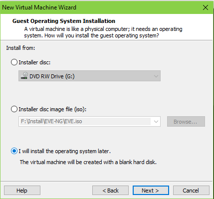
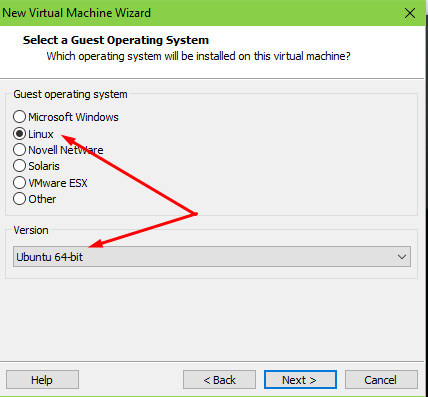
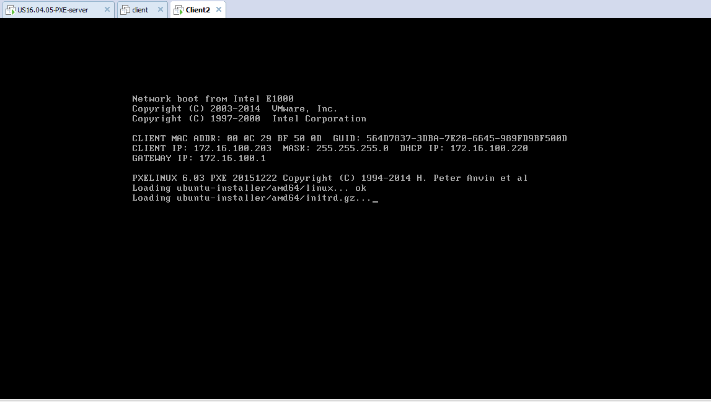
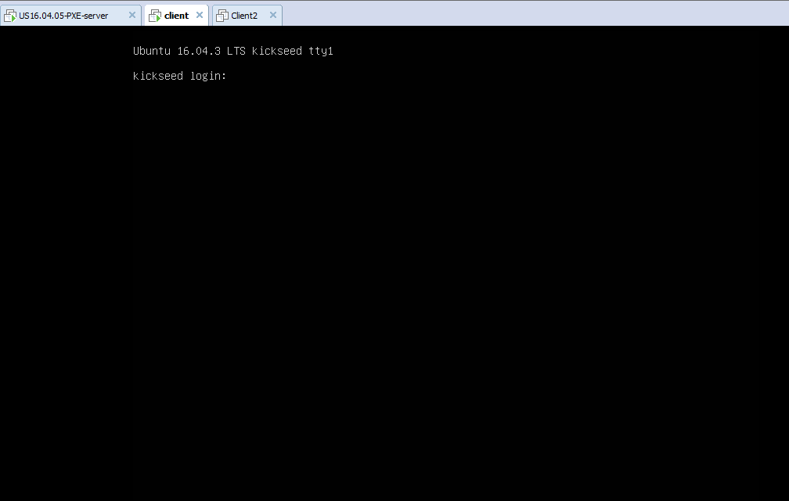
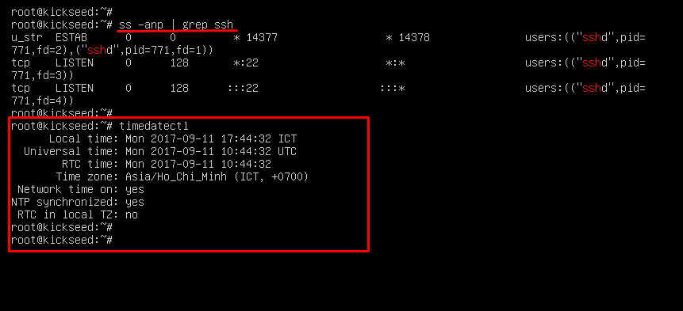
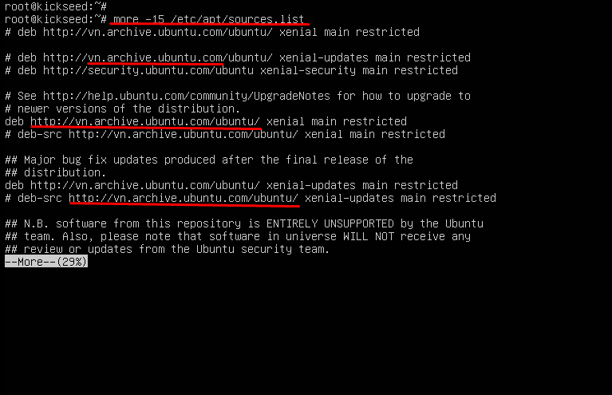

# LAB PXE - KICKSTART

###	***Mục lục***

[1.	Mô hình và chuẩn bị](#1)

[2.	Cài đặt và cấu hình DHCP server](#2)

[3.	Cài đặt và cấu hình TFTP server](#3)

- [3.1. Cài đặt cấu hình TFTP server](#3.1)

- [3.2. Bung các gói cần thiết từ file ISO](#3.2)

[4.	Cấu hình PXE và kickstart](#4)

- [4.1.	Cấu hình kickstart](#4.1)

- [4.2.	Cấu hình PXE](#4.2)

[5.	Client boot OS từ PXE](#5)

[6.	Tham khảo](#6)

---

Mục đích bài lab: Hiểu và thiết lập mô hình boot OS cho các client thông qua network.

<a name = '1'></a>
# 1.	Mô hình và chuẩn bị


- Để sử dụng PXE bạn cần cài đặt hệ thống PXE boot-server mà cho phép client:

	- Request một địa chỉ IP (thông qua DHCP)

	- Download kernel (thông qua TFTP, vì giao thức này có thể bỏ qua quá trình xác thực, các máy chưa được cài Hệ điều hành sẽ không đáp ứng được yêu cầu xác thực)

- **Chuẩn bị**: Phần này thực hiện lab trên môi trường máy ảo Vmware workstation 12. Các máy ảo cấu hình như sau:  
	-	Máy server: Ubuntu server 16.04 cài các dịch vụ DHCP server và TFTP server. Có NIC dải NAT-NET, địa chỉ 172.16.100.220  
	-	Các máy client card mạng hỗ trợ PXE. Có ít nhất một card mạng dải NAT-NET
	-	Client 1 cài OS Ubuntu server 16.04; Client 2 cài OS Centos 7  
Sau đây là các bước cấu hình:

<a name = '2'></a>
# 2.	Cài đặt và cấu hình DHCP server 

### Cài đặt gói phần mềm DHCP server cho máy server: 

`apt-get install isc-dhcp-server  -y`

### Cấu hình

- Sửa file `/etc/deefault/isc-dhcp-server` để cấp DHCP qua card ens33 (của máy server)

	`INTERFACES="ens33"`

- Cấu hình dải DHCP mà server cấp phát: sửa file `/etc/dhcp/dhcpd.conf` 

	- Bỏ comment dòng sau:
		`authoritative;`

	- Thêm các dòng sau vào cuối file để cấp phát cho dải mạng: 

		```
		subnet 172.16.100.0 netmask 255.255.255.0 {
		range 172.16.100.200 172.16.100.220;
		option domain-name-servers 8.8.8.8;
		option routers 172.16.100.1;
		option broadcast-address 172.16.100.255;
		default-lease-time 600;
		max-lease-time 7200;
		}
		```

- Cấu hình các thông tin sau cho PXE boot server: (thêm vào cuối file /etc/dhcp/dhcpd.conf)

	```
	allow booting;
	allow bootp;
	option option-128 code 128 = string;
	option option-129 code 129 = text;
	next-server 172.16.100.220; #IP cua TFTP server
	filename "pxelinux.0";
	```

- Khởi động lại dịch vụ DHCP để áp dụng thông tin vừa cấu hình: 

	`service isc-dhcp-server restart`

<a name = '3'></a>
# 3.	Cài đặt và cấu hình TFTP server 

<a name = '3.1'></a>
## 3.1. Cài đặt và cấu hình TFTP server 

### Cài đặt các gói phần mềm cần thiết cho TFTP server:

`apt-get install ftpd-hpa inetutils-inetd -y`

### Cấu hình: 

- Sửa file 	`/etc/default/tftpd-hpa` chèn vào cuối dòng trên các dòng dưới

	```
	RUN_DAEMON="yes"
	OPTIONS="-l -s /var/lib/tftpboot"
	```


- Sửa file `/etc/inetd.conf`, thêm vào cuối cùng dòng sau:

	`tftp    dgram   udp    wait    root    /usr/sbin/in.tftpd /usr/sbin/in.tftpd -s /var/lib/tftpboot`

- Tạo thư mục chứa các file boot TFTP: 

	`mkdir -p /var/lib/tftpboot/`

- Khởi động lại dịch vụ TFTP server: 
	
	`service tftpd-hpa restart`

<a name = '3.2'></a>
## 3.2.	Bung các gói cần thiết từ file ISO

Để setup install OS cho các client lấy các gói phần mềm cần thiết trong quá trình cài đặt từ TFTP server local ta thực hiện các bước như sau:

### Bước 1: Download các iso cần thiết cài đặt cho OS Ubuntu server 16.04 và Centos 7 như sau: 

```
wget http://releases.ubuntu.com/16.04/ubuntu-16.04.3-server-amd64.iso
wget http://centos-hn.viettelidc.com.vn/7/isos/x86_64/CentOS-7-x86_64-DVD-1708.iso   
```

### Bước 2: Mount các file iso vừa tải vào thư mục `/mnt` để copy tới tftpd root (`/var/lib/tftpboot/`) cho các client download file `pxelinux.0` về để tiến hành cài đặt OS (`pxelinux.0` là một đoạn mã của bootloader cho phép client lúc đó chưa có hệ điều hành có được khả năng boot OS thông qua card mạng)

`mount –o loop /root/ubuntu-16.04.3-server-amd64.iso /mnt`

- Copy các file cần thiết trong quá trình netboot cho OS linux: 

	```
	cd /mnt
	cp -fr install/netboot/* /var/lib/tftpboot/
	```

### Bước 3: Tạo thư mục chứa kenel và initrd cho từng OS:

- **Ubuntu**: đã có sẵn do trước đó copy toàn bộ từ iso của ubuntu sang thư mục tftpd root.

- **Centos**: Tạo thư mục mount cho iso centos: 

	```
	mkdir -p /mnt/centos7
	mount -o loop1 /root/CentOS-7-x86_64-DVD-1708.iso /mnt/centos7
	mkdir /var/lib/tftpboot/centos7
	cp /mnt/centos7/images/pxeboot/vmlinuz  /var/lib/tftpboot/centos7
	cp /mnt/centos7/images/pxeboot/initrd.img  /var/lib/tftpboot/centos7
	```

### Bước 4: Đưa các gói cần thiết trong quá trình cài đặt lên http server để client có thể download các gói phần mềm từ mạng local. Ở đây, cài http server lên luôn PXE server:

- Cài đặt `apache2` để các máy client có thể download thông qua HTTP: 

	`apt-get install apache2 -y`

- Tạo các thư mục cho Ubuntu và Centos: 

	```
	mkdir -p /var/www/html/US/ # thư mục cho Ubuntu
	mkdir -p /var/www/html/Centos/	#thư mục cho centos 7
	```
- Đẩy các file cần thiết cho quá trình cài đặt vào thư mục Web root: 

	- Centos: 

		```
		cp -rf /mnt/centos7/* /var/www/html/Centos/
		cd /mnt
		rm -r centos7
		```

	- Ubuntu: Đối với Ubuntu, việc copy như Centos xảy ra lỗi cho client không download được gói phần mềm từ httpd. Khắc phục bằng cách mount trực tiếp iso ubuntu vào thư mục /var/www/html/US/

		`mount -o loop /root/ubuntu-16.04.3-server-amd64.iso /var/www/html/US/`


<a name = '4'></a>
# 4.	Cấu hình PXE và kickstart

<a name = '4.1'></a>
## 4.1.	Cấu hình kickstart

- Tạo file kickstart cho client cài đặt OS Ubuntu server 16.04 có nội dung tùy chỉnh như sau:

	```
	# set language to use during installation
	lang en_US
	langsupport en_US

	# set keyboard layout for the system
	keyboard us

	# reboot the system after installation
	reboot
	# config repo source.list
	url --url http://172.16.100.10/US/

	# Sets up the authentication options for the system.
	auth --useshadow --enablemd5

	bootloader --location=mbr

	zerombr yes

	clearpart --all

	# setup timezone
	timezone Asia/Ho_Chi_Minh

	# Set the system's root password
	rootpw rootpassword123

	# Creates a new user on the system
	user ttp --fullname=ttp --password=ttppassword123
	# create partition on the system with LVM
	part pv.01 --size 1 --grow

	volgroup ubuntu pv.01
	logvol swap --fstype swap --name=swap --vgname=ubuntu --size 1024
	logvol / --fstype ext4 --vgname=ubuntu --size=1 --grow --name=slash

	# hack around Ubuntu kickstart bugs
	preseed partman-lvm/confirm_nooverwrite boolean true
	preseed partman-auto-lvm/no_boot boolean true

	# Configures network information

	#network --bootproto=dhcp --device=ens34 --active
	network --bootproto=dhcp --device=ens33 --active

	# Do not configure the X Window System
	skipx

	## Install packet for the system
	%packages  --ignoremissing
	@ ubuntu-server
	openssh-server

	## Run script after installation
	%post
	sed -i 's/172.16.100.10/vn.archive.ubuntu.com/g' /etc/apt/sources.list
	sed -i 's/US/ubuntu/g' /etc/apt/sources.list
	apt-get update -y && apt-get upgrade –y
	mkdir /root/test
	```

	- Lưu file lại với tên `kickstartForUS16.04.cfg` 

	- Chuyển file kickstartForUS16.04.cfg vào thư mục web root như sau: 

		`mv kickstartForUS16.04.cfg /var/www/html/`

- Tạo file kickstart cho client cài đặt OS Centos 7 có nội dung tùy chỉnh như sau:

	```
	#version=RHEL7
	# System authorization information
	auth --enableshadow --passalgo=sha512
	# Use network installation
	url --url="http://172.16.100.10/Centos/"
	# Run the Setup Agent on first boot
	firstboot --enable
	ignoredisk --only-use=sda
	reboot
	# Keyboard layouts
	keyboard --vckeymap=us --xlayouts='us'
	# System language
	lang en_US.UTF-8
	# Network information
	#network  --bootproto=dhcp --device=eno33554960 --ipv6=auto --activate --nodefault
	network  --bootproto=dhcp --device=eno16777736 --ipv6=auto --activate
	network  --hostname=CentosTest
	# Root password
	rootpw toilatam
	user ttp --name=ttp --password=toilatam
	# System services
	services --enabled="chronyd"
	# System timezone
	timezone Asia/Ho_Chi_Minh
	# System bootloader configuration
	bootloader --location=mbr 
	# Partition clearing information
	clearpart --all
	# Disk partitioning information
	part pv.20 --fstype="lvmpv" --ondisk=sda --size=19979
	part /boot --fstype="xfs" --ondisk=sda --size=500
	volgroup centos --pesize=4096 pv.20
	logvol /  --fstype="xfs" --grow --maxsize=51200 --size=1024 --name=root --vgname=centos
	logvol swap  --fstype="swap" --size=2048 --name=swap01 --vgname=centos

	%packages
	@compat-libraries
	@core
	wget
	%end
	%post
	mkdir -p /root/test
	cd /root/test
	wget https://raw.githubusercontent.com/ThanhTamPotter/thuctap012017/master/TamNT/PXE-Kickstart/config_files/anaconda-ks-forCentos7.cfg
	%end
	```

	- Lưu file lại với tên `anaconda-ks.cfg` 

	- Chuyển file kickstartForUS16.04.cfg vào thư mục web root như sau: 

		`mv anaconda-ks.cfg /var/www/html/`


<a name = '4.2'></a>
## 4.2.	Cấu hình PXE

- Sửa file `/var/lib/tftpboot/pxelinux.cfg/default` để khai báo menu của PXE boot, nội dung giống như sau:

	```
	# D-I config version 2.0
	# search path for the c32 support libraries (libcom32, libutil etc.)
	path ubuntu-installer/amd64/boot-screens/
	include ubuntu-installer/amd64/boot-screens/menu.cfg
	default ubuntu-installer/amd64/boot-screens/vesamenu.c32
	DISPLAY boot.txt

	LABEL Ubuntu_server_16.04_Install
			kernel ubuntu-installer/amd64/linux
			append ks=http://172.16.100.220/kickstartForUS16.04.cfg ksdevice=ens33 vga=normal initrd=ubuntu-installer/amd64/initrd.gz --

	LABEL Centos_7_x64_Install
	kernel centos7/vmlinuz
	append initrd=centos7/initrd.img inst.ks=http://172.16.100.10/anaconda-ks.cfg inst.vnc inst.vncpassword=password
	prompt 0
	timeout 0

	```


<a name = '5'></a>
# 5.	Client boot OS từ PXE

- Tạo một máy ảo Client1 mới chưa setup hệ điều hành như sau: 

	

	


- Bật máy ảo lên, ta có giao diện hiển thị như sau: 

	

- Sau khi có IP và download được file pxelinux.0 client sẽ tự động load menu boot lựa chọn boot  như sau:

	

- Lựa chọn OS cần cài đặt. Sau khi cài đặt xong, máy client1 có giao diện như sau: 

	

- Đăng nhập bằng user ttp với mật khẩu ttppassword123 như đã tạo trong file kickstart => thành công. Chuyển sang chế độ user root thành công, chứng tỏ `ttp` là `sudoer`: 

	

- Kiểm tra lại các thông tin đã cấu hình trong kickstart như user `ttp`, setup `openssh-server`, `timezone` và repo sourcelist đã được đổi sang repo public (trong script phần %post) đều chính xác như sau:

	

	

- Tương tự với Client 2. 

<a name = '6'></a>
# 6.	Tham khảo

[1] configuration kickstart: https://access.redhat.com/documentation/en-US/Red_Hat_Enterprise_Linux/6/html/Installation_Guide/ch-kickstart2.html   
[2] https://help.ubuntu.com/community/PXEInstallServer  
[3] https://github.com/congto/ghichep-PXE-kickstart/blob/master/ghichep-PXE-kickstart.md   
[4] https://debian-administration.org/article/478/Setting_up_a_server_for_PXE_network_booting  
[5] https://www.tecmint.com/multiple-centos-installations-using-kickstart/   
