# LINUX NETWORK NAMESPACES

### ***Mục lục***

[1. Giới thiệu Linux namespace](#1)

- [1.1. Linux namespace là gì?](#1.1)

- [1.2.	Một số thao tác quản lý làm việc với linux network namespace](#1.2)

	- [1.2.1. List namespace](#1.2.1)

	- [1.2.2.	Add namespaces](#1.2.2)

	- [1.2.3.	Executing commands trong namespaces](#1.2.3)

	- [1.2.4.	Gán interface vào một network namespace](#1.2.4)

	- [1.2.5.	Xóa namespace](#1.2.5)

[2.	Một số bài lab thử nghiệm tính năng của linux network namespace](#2)

- [2.1. Kết nối 2 namespace sử dụng Openvswitch](#2.1)

	- [2.1.1. Kết nối thông qua virtual ethernet (veth)](#2.1.1)

	- [2.1.2.	Kết nối thông qua OVS port](#2.1.2)

- [2.2.	Cấu hình cấp DHCP cho 2 namespace khác nhau](#2.2)

	- [2.2.1. Mô hình](#2.2.1)

	- [2.2.2.	Cấu hình](#2.2.2)

[3.	Tham khảo](#3)

---

<a name = '1'></a>
# 1.	Giới thiệu Linux namespace

<a name = '1.1'></a>
## 1.1.	Linux namespace là gì?

- Chuyển mạch trên phần mềm trong hệ thống linux là một trong những phần quan trọng khi sử dụng các công nghệ ảo hóa như KVM hay LXC. Các host thông thường không cung cấp một hoặc nhiều hơn một bộ chuyển đổi adapter vật lý cho mỗi giao diện mạng NIC trên một máy ảo VM trong KVM hay mỗi container sử dụng LXC. 

- **Network namspace** là khái niệm cho phép bạn cô lập môi trường mạng network trong một host. Namespace phân chia việc sử dụng các khác niệm liên quan tới network như devices, địa chỉ addresses, ports, định tuyến và các quy tắc tường lửa vào trong một hộp (box) riêng biệt, chủ yếu là ảo hóa mạng trong một máy chạy một kernel duy nhất. 

- Mỗi network namespaces có bản định tuyến riêng, các thiết lập iptables riêng cung cấp cơ chế NAT và lọc đối với các máy ảo thuộc namespace đó. Linux network namespaces cũng cung cấp thêm khả năng để chạy các tiến trình riêng biệt trong nội bộ mỗi namespace.

- Network namespace được sử dụng trong khá nhiều dự án như Openstack, Docker và Mininet. 

<a name = '1.2'></a>
## 1.2.	Một số thao tác quản lý làm việc với linux network namespace

Ban đầu, khi khởi động hệ thống Linux, bạn sẽ có một namespace mặc định đã chạy trên hệ thống và mọi tiến trình mới tạo sẽ thừa kế namespace này, gọi là root namespace. Tất cả các quy trình kế thừa network namespace được init sử dụng (PID 1).

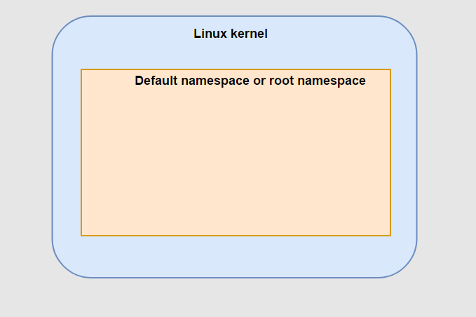

<a name = '1.2.1'></a>
### 1.2.1.	List namespace

- Cách để làm việc với network namespace là sử dụng câu lệnh ip netns (tìm hiểu thêm tại [man ip netns](http://manpages.ubuntu.com/manpages/xenial/en/man8/ip-netns.8.html)) 

- Để liệt kê tất cả các network namespace trên hệ thống sử dụng câu lệnh: 

	```
	ip netns
	# or
	ip netns list
	```
- Nếu chưa thêm bất kì network namespace nào thì đầu ra màn hình sẽ để trống. root namespace sẽ không được liệt kê khi sử dụng câu lệnh ip netns list.

<a name = '1.2.2'></a>
### 1.2.2.	Add namespaces

- Để thêm một network namespace sử dụng lệnh `ip netns add <namespace_name>` 

- Ví dụ: tạo thêm 2 namespace là ns1 và ns2 như sau:

	``` 
	ip netns add ns1
	ip netns add ns2
	```

	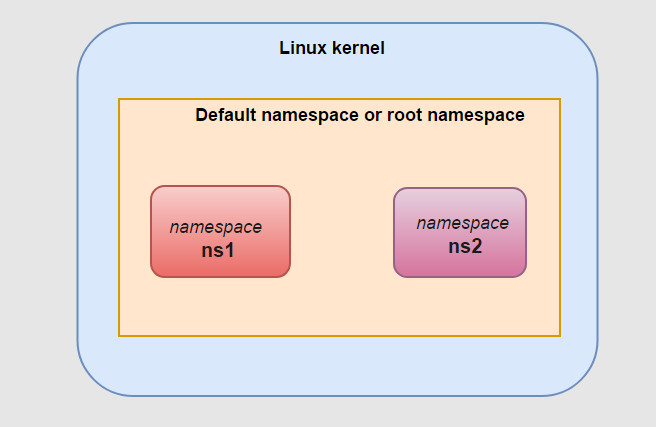

- Sử dụng câu lệnh ip netns hoặc ip netns list để hiển thị các namespace hiện tại:

	```
	root@controller:~#
	root@controller:~# ip netns
	ns2
	ns1
	root@controller:~#
	root@controller:~# ip netns list
	ns2
	ns1
	root@controller:~#
	```

- Mỗi khi thêm vào một namespace, một file mới được tạo trong thư mục `/var/run/netns` với tên giống như tên namespace. (không bao gồm file của root namespace).

	```
	root@controller:~# ls -l /var/run/netns
	total 0
	-r--r--r-- 1 root root 0 Aug  1 09:14 ns1
	-r--r--r-- 1 root root 0 Aug  1 09:14 ns2
	root@controller:~#
	```

<a name = '1.2.3'></a>
### 1.2.3.	Executing commands trong namespaces

- Để xử lý các lệnh trong một namespace (không phải root namespace) sử dụng `ip netns exec <namespace> <command>`

	Tham khảo thêm tại: [man ip netns](http://manpages.ubuntu.com/manpages/xenial/en/man8/ip-netns.8.html) 

- Ví dụ: chạy lệnh `ip a` liệt kê địa chỉ các interface trong namespace ns1.

	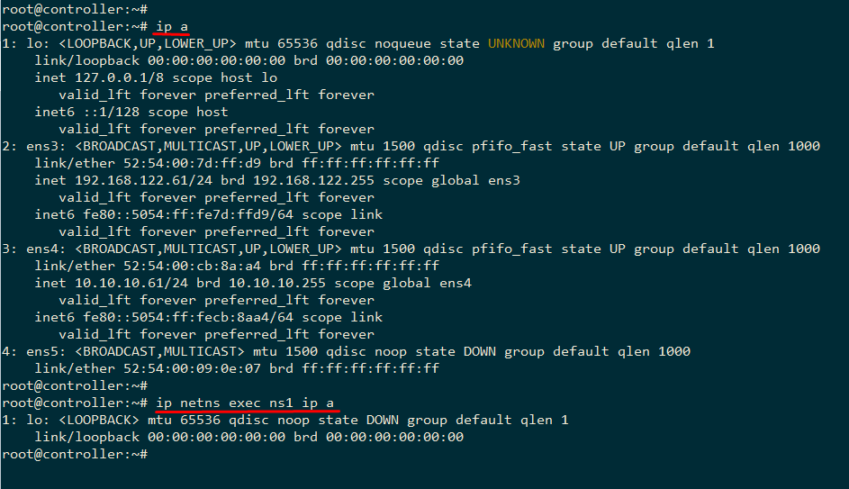

- Kết quả đầu ra sẽ khác so với khi chạy câu lệnh ip a ở chế độ mặc định (trong root namespace). Mỗi namespace sẽ có một môi trường mạng cô lập và có các interface và bảng định tuyến riêng.

- Để liệt kê tất các các địa chỉ interface của các namespace sử dụng tùy chọn `–a` hoặc `–all` như sau: 

	```
	root@controller:~# ip -a netns  exec ip a

	netns: ns2
	1: lo: <LOOPBACK> mtu 65536 qdisc noop state DOWN group default qlen 1
	    link/loopback 00:00:00:00:00:00 brd 00:00:00:00:00:00

	netns: ns1
	1: lo: <LOOPBACK> mtu 65536 qdisc noop state DOWN group default qlen 1
	    link/loopback 00:00:00:00:00:00 brd 00:00:00:00:00:00
	root@controller:~#
	root@controller:~#
	root@controller:~# ip --all netns  exec ip a

	netns: ns2
	1: lo: <LOOPBACK> mtu 65536 qdisc noop state DOWN group default qlen 1
	    link/loopback 00:00:00:00:00:00 brd 00:00:00:00:00:00

	netns: ns1
	1: lo: <LOOPBACK> mtu 65536 qdisc noop state DOWN group default qlen 1
	    link/loopback 00:00:00:00:00:00 brd 00:00:00:00:00:00
	root@controller:~#
	```
- Để sử dụng các câu lệnh với namespace ta sử dụng command bash để xử lý các câu lệnh trong riêng namespace đã chọn: 

	```
	ip netns exec <namespace_name> bash
	ip a #se chi hien thi thong tin trong namespace <namespace_name> 
	```

	Thoát khỏi vùng làm việc của namespace gõ exit

- Ví dụ:

	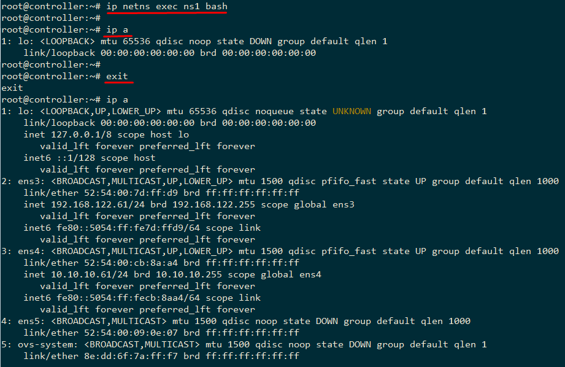

<a name = '1.2.4'></a>
### 1.2.4.	Gán interface vào một network namespace

- Sử dụng câu lệnh sau để gán interface vào namespace:

	`ip link set <interface_name> netns <namespace_name>`

- Gán một interface if1 vào namespace ns1 sử dụng lệnh sau: 

	`ip link set <interface_name> netns <namespace_name>`

- Các thao tác khác tương tự như các câu lệnh bình thường, thêm `ip netns exec <namespace_name> <command>`

<a name = '1.2.5'></a>
### 1.2.5.	Xóa namespace

Xóa namespace sử dụng câu lệnh: 

`ip netns delete <namespace_name>`

<a name = '2'></a>
# 2.	Một số bài lab thử nghiệm tính năng của linux network namespace

<a name = '2.1'></a>
## 2.1.	Kết nối 2 namespace sử dụng Openvswitch

Xét một ví dụ đơn giản, kết nối 2 namespace sử dụng một virtual switch và gửi bản tin ping từ một namespace tới namespace khác.

2 virtual switch thông dụng nhất trong hệ thống ảo hóa trên linux là **linux bridge** và **Openvswitch**. Phần lab này sẽ sử dụng Openvswitch. 

<a name = '2.1.1'></a>
### 2.1.1.	Kết nối thông qua virtual ethernet (veth)

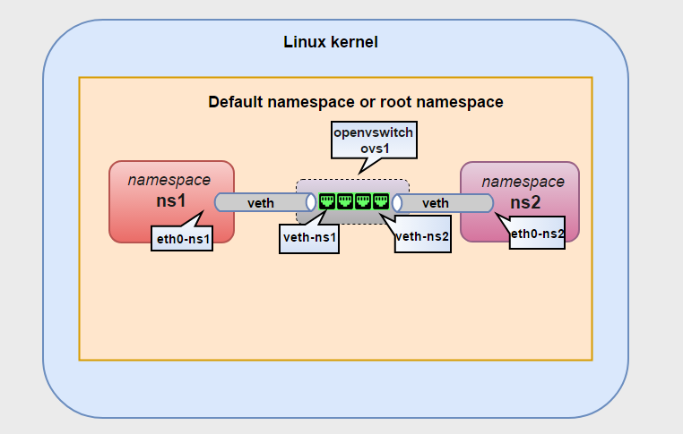

#### - Thêm Virtual switch ovs1

`ovs-vsctl add-br ovs1`

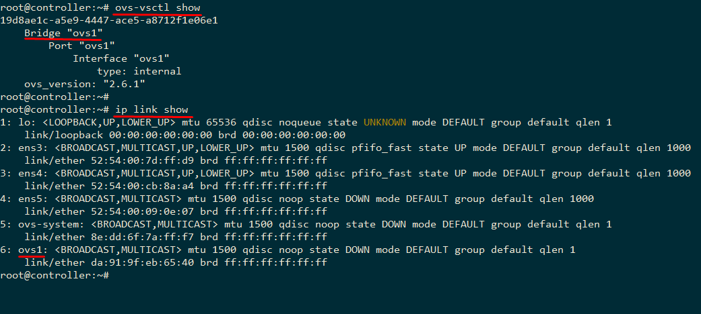

#### - Thêm cặp veth

- Để kết nối các namespace tới swtich, sử dụng veth pairs. 

- ***Virtual Ethernet interfaces (hay veth)*** là một kiến trúc thú vị, chúng luôn có 1 cặp, và được sử dụng để kết nối như một đường ống: các lưu lượng tới từ một đầu veth và được đưa ra, peer tới giao diện veth còn lại. Như vậy, có thể dùng veth để kết nối mạng trong namespace từ trong ra ngoài root namespace trên các interface vật lý của root namespace.

- Thêm một veth pairs sử dụng lệnh: 

	`ip link add veth0 type veth peer name veth1`

	Khi đó, một veth được tạo ra với 2 đầu là 2 interface veth0 và veth1. 

- Như mô hình trong bài, thêm veth nối giữa namespace **ns1** và switch **ovs1** :

	`ip link add veth-ns1 type veth peer name eth0-ns1`

- Thêm veth dùng để nối giữa **ns2** và **ovs1**: 

	`ip link add veth-ns2 type veth peer name eth0-ns2`

	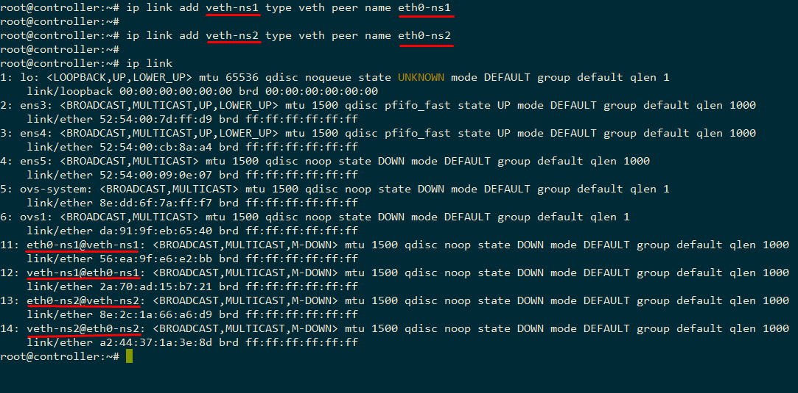

#### - Gán các interface vào namespace tương ứng

- Chuyển interface eth0-ns1 và namespace ns1 và eth1-ns2 vào namespace ns2 và bật lên:

	```
	ip link set eth0-ns1 netns ns1
	ip netns exec ns1 ip link set eth0-ns1 up

	ip link set eth0-ns2 netns ns2
	ip netns exec ns2 ip link set eth0-ns2 up
	```

- Các interface còn lại gán vào openvswitch port: 

	```
	ip link set veth-ns1 up
	ip link set veth-ns2 up
	ovs-vsctl add-port ovs1 veth-ns1
	ovs-vsctl add-port ovs1 veth-ns2
	```

	- ***Lưu ý***: khi thêm 2 đầu interface của các veth vào namespace hoặc openvswitch thì phải bật các device lên (device hiểu đơn giản trong trường hợp này là 2 đầu interface của veth). Sử dụng câu lệnh: `ip link set <device_name> up`

- Kiểm tra lại sử dụng câu lệnh: `ovs-vsctl show` được kết quả như sau: 

	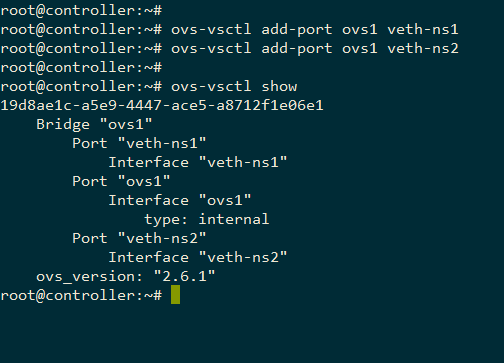

#### - Gán địa chỉ IP và ping thử giữa 2 namespace

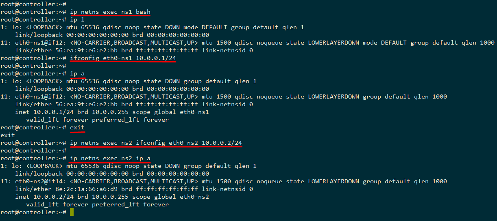

Tiến hành ping thử giữa 2 namespace: 

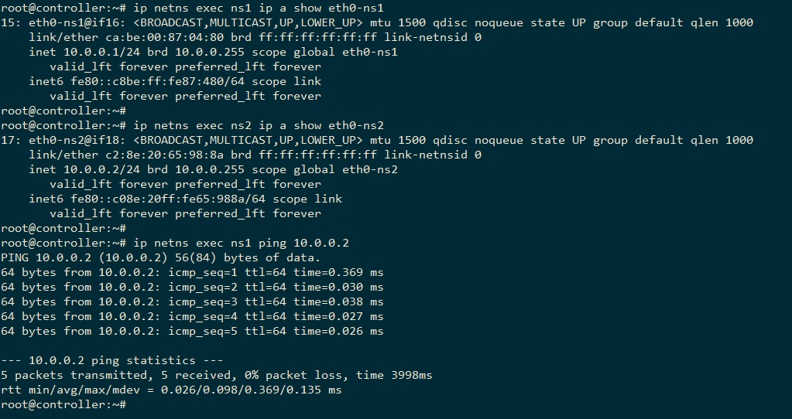

<a name = '2.1.2'></a>
### 2.1.2.	Kết nối thông qua OVS port

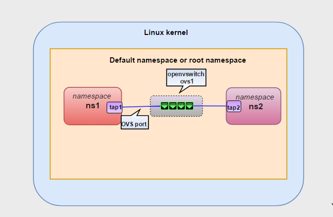

- Cách này không kết nối các namespace thông qua veth, mà sử dụng kết nối trực tiếp thông qua port internal của Openvswitch. 

- Cách thực hiện tương tự như phần trên, không tạo thêm 2 veth mà tạo ra 2 port tap1 và tap2 type internal trên ovs1: 

	```
	ovs-vsctl add-port ovs1 tap1 -- set interface tap1 type=internal
	ovs-vsctl add-port ovs1 tap2 -- set interface tap2 type=internal
	```

	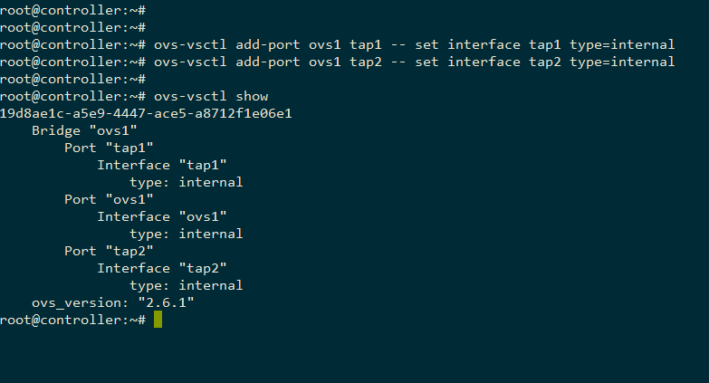

- Gán 2 port trên vào 2 namespace tương ứng như mô hình: 

	```
	ip link set tap1 netns ns1
	ip link set tap2 netns ns2
	ip netns exec ns1 ip link set tap1 up
	ip netns exec ns2 ip link set tap2 up
	```

- Gán địa chỉ IP và ping thử giữa 2 interface: 

	```
	ip netns exec ns1 ifconfig tap1 10.10.0.10/24
	ip netns exec ns2 ifconfig tap2 10.10.0.20/24
	```
	
	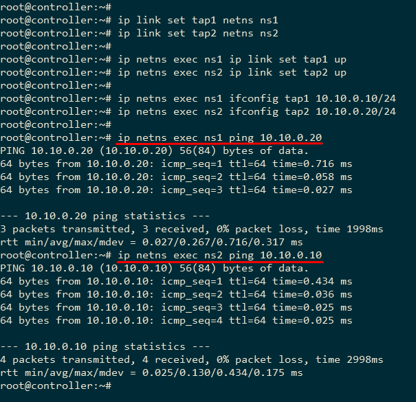

<a name = '2.2'></a>
## 2.2.	Cấu hình cấp DHCP cho 2 namespace khác nhau

<a name = '2.2.1'></a>
### 2.2.1.	Mô hình

Topology sau đây lấy ý tưởng từ hệ thống OpenStack. Trên mỗi máy Compute, các máy ảo thuộc về mỗi vlan đại diện cho các máy của một tenant. Chúng tách biệt về layer 2 và được cấp phát IP bởi các DHCP server ảo cùng VLAN (các DHCP server ảo này thuộc về các namespaces khác nhau và không cùng namespace với các máy ảo của các tenant, được cung cấp bởi dịch vụ dnsmasq). Các DHCP server này hoàn toàn có thể cấp dải địa chỉ trùng nhau do tính chất của namespace. Sau đây là mô hình:

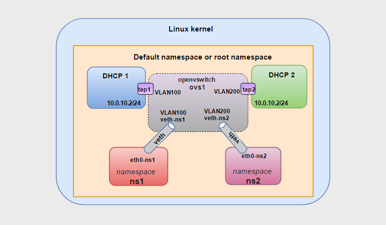

Mô hình bài lab bao gồm 2 DHCP namespace (DHCP1, DHCP2) và hai namespaces dành cho các máy ảo của 2 tenant (ns1, ns2), các máy ảo trên 2 tenant này thuộc về hai VLANkhác nhau (VLAN100 và VLAN200). DHCP server trên các namespace DHCP1, DHCP2 sẽ cấp địa chỉ IP cho các máy ảo của 2 tenant trên 2 namespace tương ứng là ns1 và ns2.

<a name = '2.2.2'></a>
### 2.2.2.	Cấu hình

#### - Tạo veth kết nối 2 network namespace và ovs1: 

```
ip link add veth-ns1 type veth peer name eth0-ns1
ip link add veth-ns2 type veth peer name eth0-ns2
ip link set eth0-ns1 netns ns1
ip link set eth0-ns2 netns ns2
ip link set veth-ns1 up
ip link set veth-ns2 up
ip netns exec ns1 ip link set lo up
ip netns exec ns1 ip link set eth0-ns1 up
ip netns exec ns2 ip link set lo up
ip netns exec ns2 ip link set eth0-ns2 up

ovs-vsctl add-port ovs1 veth-ns1 -- set port veth-ns1 tag=100
ovs-vsctl add-port ovs1 veth-ns2 -- set port veth-ns2 tag=200
```

#### - Tạo 2 namespace cho các DHCP namespace: 

```
ip netns add DHCP1
ip netns add DHCP2
```

- Trên switch ảo ovs1 tạo 2 internal interface là tap1 và tap2 để kết nối với 2 namespaces tương ứng là DHCP1 và DHCP2. Chú ý gán tap1 vào VLAN100, tap2 vào VLAN200:

	```
	# cau hinh tap1
	ovs-vsctl add-port ovs1 tap1 -- set interface tap1 type=internal
	ovs-vsctl set port tap1 tag=100
	# cau hinh tag2
	ovs-vsctl add-port ovs1 tap2 -- set interface tap2 type=internal
	ovs-vsctl set port tap2 tag=200
	```

- Kiểm tra lại cấu hình ta được như sau: 

	```
	root@controller:~# ovs-vsctl show
	19d8ae1c-a5e9-4447-ace5-a8712f1e06e1
	    Bridge "ovs1"
	        Port "veth-ns1"
	            tag: 100
	            Interface "veth-ns1"
	        Port "tap1"
	            tag: 100
	            Interface "tap1"
	                type: internal
	        Port "tap2"
	            tag: 200
	            Interface "tap2"
	                type: internal
	        Port "veth-ns2"
	            tag: 200
	            Interface "veth-ns2"
	        Port "ovs1"
	            Interface "ovs1"
	                type: internal
	    ovs_version: "2.6.1"
	```

#### - Cấu hình DHCP namespace

- Gán 2 internal interface tap1 và tag2 trên lần lượt vào các namespace DHCP1 và DHCP2. Chú ý là thực hiện hai thao tác này trên bash của root namespace. Nếu đang thao tác trong các namespace ns1 và ns2 thì phải thoát ra bằng lệnh exit cho tới khi trở về root namespace.

	```
	ip link set tap1 netns DHCP1
	ip link set tap2 netns DHCP2
	```   

- Thiết lập IP cho các internal interfaces tap1 và tag2. Thiết lập dải địa chỉ cấp phát cho các máy ảo trên các các tenant namespaces tương ứng ns1 và ns2 sử dụng [dnsmasq]( http://www.thekelleys.org.uk/dnsmasq/docs/dnsmasq-man.html) (nếu máy host chưa có cần cài đặt dùng lệnh: `apt-get install dnsmasq –y` )

- Cấu hình cho tap1

	```
	# cau hinh IP cho tap1
	ip netns exec DHCP1 bash 
	ip link set dev lo up
	ip link set dev tap1 up
	ip address add 10.0.10.2/24 dev tap1
	# cau hinh dai dia chi cap phat cho cac may ao trong namespace ns1
	ip netns exec DHCP1 dnsmasq --interface=tap1 \
	--dhcp-range=10.0.10.10,10.0.10.100,255.255.255.0
	```

- Cấu hình cho tap2

	```
	# cau hinh IP cho tap2
	ip netns exec DHCP2 bash
	ip link set dev lo up
	ip link set dev tap2 up
	ip address add 10.0.10.2/24 dev tap2
	# cau hinh dai dia chi cap phat cho cac may ao trong namespace ns2
	ip netns exec DHCP2 dnsmasq --interface=tap2 \
	--dhcp-range=10.0.10.10,10.0.10.100,255.255.255.0
	```

- Kiểm tra lại các tiến trình dnsmasq đã cấu hình chính xác chưa: 

	```
	ps aux | grep dnsmasq
	# kết quả
	nobody   13765  0.0  0.0  52876   412 ?        S    15:18   0:00 dnsmasq --interface=tap1 --dhcp-range=10.0.10.10,10.0.10.100,255.255.255.0
	nobody   13785  0.0  0.0  52876   412 ?        S    15:19   0:00 dnsmasq --interface=tap2 --dhcp-range=10.0.10.10,10.0.10.100,255.255.255.0
	```

#### - Xin cấp phát địa chỉ IP

- Ta sẽ cấp phát IP cho các virtual interfaces eth0-ns1 và eth0-ns2 thuộc hai namespaces tương ứng ns1 và ns2.

- Xin cấp IP cho eth0-ns1 và kiểm tra địa chỉ IP trong namespace ns1.

	```
	ip netns exec ns1 dhclient eth0-ns1 # xin cap dia chi IP
	ip netns exec ns1 ip a
	```

	Kết quả như sau: 

	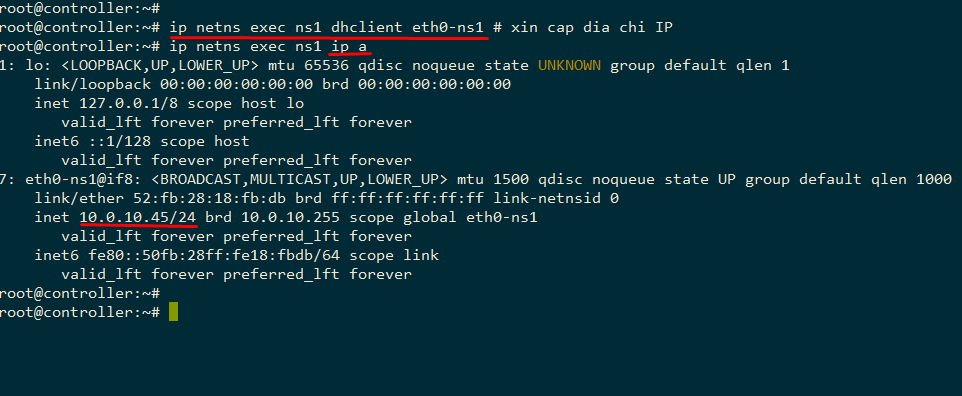

- Cấp IP cho eth0-ns2 và kiểm tra địa chỉ IP trong namespace ns2

	```
	ip netns exec ns2 dhclient eth0-ns2
	ip netns exec ns2 ip a
	```

	Kết quả như sau: 

	


=> Chứng tỏ: khi sử dụng network namespace, ta có thể tận dụng được tài nguyên mạng. 

<a name = '3'></a>
# 3.	Tham khảo

[1] man page ip netns: http://manpages.ubuntu.com/manpages/xenial/en/man8/ip-netns.8.html

[2] https://github.com/thaihust/Thuc-tap-thang-03-2016/blob/master/ThaiPH/ThaiPH_linux_network_namespaces.md#complex

[3] http://abregman.com/2016/09/29/linux-network-namespace/

[4] http://blog.scottlowe.org/2013/09/04/introducing-linux-network-namespaces/index.html

[5] https://www.youtube.com/watch?v=_WgUwUf1d34

[6] http://www.opencloudblog.com/?p=66 


